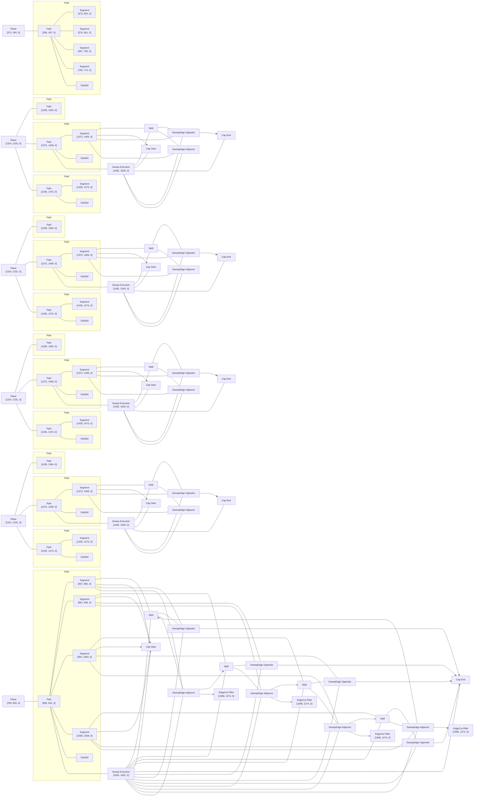

```mermaid
flowchart LR
  subgraph path7 [Path]
    7["Path<br>[396, 467, 0]"]
    21["Segment<br>[473, 564, 0]"]
    22["Segment<br>[570, 661, 0]"]
    23["Segment<br>[667, 760, 0]"]
    24["Segment<br>[766, 774, 0]"]
    42[Solid2d]
  end
  subgraph path8 [Path]
    8["Path<br>[806, 831, 0]"]
    25["Segment<br>[837, 885, 0]"]
    26["Segment<br>[891, 948, 0]"]
    27["Segment<br>[954, 1003, 0]"]
    28["Segment<br>[1009, 1028, 0]"]
    46[Solid2d]
  end
  subgraph path9 [Path]
    9["Path<br>[1339, 1364, 0]"]
  end
  subgraph path10 [Path]
    10["Path<br>[1339, 1364, 0]"]
  end
  subgraph path11 [Path]
    11["Path<br>[1339, 1364, 0]"]
  end
  subgraph path12 [Path]
    12["Path<br>[1339, 1364, 0]"]
  end
  subgraph path13 [Path]
    13["Path<br>[1372, 1409, 0]"]
    29["Segment<br>[1372, 1409, 0]"]
    40[Solid2d]
  end
  subgraph path14 [Path]
    14["Path<br>[1372, 1409, 0]"]
    32["Segment<br>[1372, 1409, 0]"]
    41[Solid2d]
  end
  subgraph path15 [Path]
    15["Path<br>[1372, 1409, 0]"]
    31["Segment<br>[1372, 1409, 0]"]
    43[Solid2d]
  end
  subgraph path16 [Path]
    16["Path<br>[1372, 1409, 0]"]
    30["Segment<br>[1372, 1409, 0]"]
    44[Solid2d]
  end
  subgraph path17 [Path]
    17["Path<br>[1435, 1473, 0]"]
    34["Segment<br>[1435, 1473, 0]"]
    37[Solid2d]
  end
  subgraph path18 [Path]
    18["Path<br>[1435, 1473, 0]"]
    35["Segment<br>[1435, 1473, 0]"]
    38[Solid2d]
  end
  subgraph path19 [Path]
    19["Path<br>[1435, 1473, 0]"]
    33["Segment<br>[1435, 1473, 0]"]
    39[Solid2d]
  end
  subgraph path20 [Path]
    20["Path<br>[1435, 1473, 0]"]
    36["Segment<br>[1435, 1473, 0]"]
    45[Solid2d]
  end
  1["Plane<br>[373, 390, 0]"]
  2["Plane<br>[783, 800, 0]"]
  3["Plane<br>[1314, 1331, 0]"]
  4["Plane<br>[1314, 1331, 0]"]
  5["Plane<br>[1314, 1331, 0]"]
  6["Plane<br>[1314, 1331, 0]"]
  47["Sweep Extrusion<br>[1034, 1062, 0]"]
  48["Sweep Extrusion<br>[1482, 1506, 0]"]
  49["Sweep Extrusion<br>[1482, 1506, 0]"]
  50["Sweep Extrusion<br>[1482, 1506, 0]"]
  51["Sweep Extrusion<br>[1482, 1506, 0]"]
  52[Wall]
  53[Wall]
  54[Wall]
  55[Wall]
  56[Wall]
  57[Wall]
  58[Wall]
  59[Wall]
  60["Cap Start"]
  61["Cap Start"]
  62["Cap Start"]
  63["Cap Start"]
  64["Cap Start"]
  65["Cap End"]
  66["Cap End"]
  67["Cap End"]
  68["Cap End"]
  69["Cap End"]
  70["SweepEdge Opposite"]
  71["SweepEdge Opposite"]
  72["SweepEdge Opposite"]
  73["SweepEdge Opposite"]
  74["SweepEdge Opposite"]
  75["SweepEdge Opposite"]
  76["SweepEdge Opposite"]
  77["SweepEdge Opposite"]
  78["SweepEdge Adjacent"]
  79["SweepEdge Adjacent"]
  80["SweepEdge Adjacent"]
  81["SweepEdge Adjacent"]
  82["SweepEdge Adjacent"]
  83["SweepEdge Adjacent"]
  84["SweepEdge Adjacent"]
  85["SweepEdge Adjacent"]
  86["EdgeCut Fillet<br>[1068, 1274, 0]"]
  87["EdgeCut Fillet<br>[1068, 1274, 0]"]
  88["EdgeCut Fillet<br>[1068, 1274, 0]"]
  89["EdgeCut Fillet<br>[1068, 1274, 0]"]
  1 --- 7
  2 --- 8
  3 --- 10
  3 --- 13
  3 --- 18
  4 --- 12
  4 --- 16
  4 --- 17
  5 --- 9
  5 --- 14
  5 --- 20
  6 --- 11
  6 --- 15
  6 --- 19
  7 --- 21
  7 --- 22
  7 --- 23
  7 --- 24
  7 --- 42
  8 --- 25
  8 --- 26
  8 --- 27
  8 --- 28
  8 --- 46
  8 ---- 47
  13 --- 29
  13 --- 40
  13 ---- 49
  14 --- 32
  14 --- 41
  14 ---- 51
  15 --- 31
  15 --- 43
  15 ---- 50
  16 --- 30
  16 --- 44
  16 ---- 48
  17 --- 34
  17 --- 37
  18 --- 35
  18 --- 38
  19 --- 33
  19 --- 39
  20 --- 36
  20 --- 45
  25 --- 56
  25 x--> 64
  25 --- 75
  25 --- 85
  26 --- 57
  26 x--> 64
  26 --- 74
  26 --- 82
  27 --- 59
  27 x--> 64
  27 --- 76
  27 --- 83
  28 --- 58
  28 x--> 64
  28 --- 77
  28 --- 84
  29 --- 53
  29 x--> 62
  29 --- 71
  29 --- 79
  30 --- 52
  30 x--> 61
  30 --- 70
  30 --- 78
  31 --- 54
  31 x--> 60
  31 --- 72
  31 --- 80
  32 --- 55
  32 x--> 63
  32 --- 73
  32 --- 81
  47 --- 56
  47 --- 57
  47 --- 58
  47 --- 59
  47 --- 64
  47 --- 69
  47 --- 74
  47 --- 75
  47 --- 76
  47 --- 77
  47 --- 82
  47 --- 83
  47 --- 84
  47 --- 85
  48 --- 52
  48 --- 61
  48 --- 66
  48 --- 70
  48 --- 78
  49 --- 53
  49 --- 62
  49 --- 67
  49 --- 71
  49 --- 79
  50 --- 54
  50 --- 60
  50 --- 65
  50 --- 72
  50 --- 80
  51 --- 55
  51 --- 63
  51 --- 68
  51 --- 73
  51 --- 81
  52 --- 70
  52 --- 78
  53 --- 71
  53 --- 79
  54 --- 72
  54 --- 80
  55 --- 73
  55 --- 81
  56 --- 75
  84 <--x 56
  56 --- 85
  57 --- 74
  57 --- 82
  85 <--x 57
  58 --- 77
  83 <--x 58
  58 --- 84
  59 --- 76
  82 <--x 59
  59 --- 83
  72 <--x 65
  70 <--x 66
  71 <--x 67
  73 <--x 68
  74 <--x 69
  75 <--x 69
  76 <--x 69
  77 <--x 69
  82 <--x 86
  83 <--x 88
  84 <--x 87
  85 <--x 89
```
