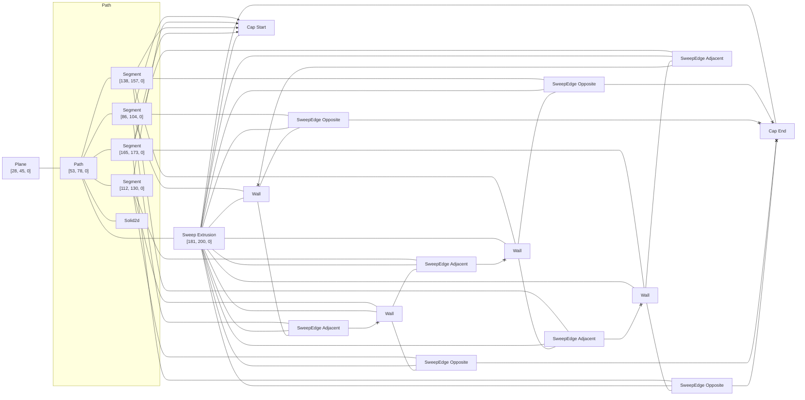

```mermaid
flowchart LR
  subgraph path2 [Path]
    2["Path<br>[53, 78, 0]"]
    3["Segment<br>[86, 104, 0]"]
    4["Segment<br>[112, 130, 0]"]
    5["Segment<br>[138, 157, 0]"]
    6["Segment<br>[165, 173, 0]"]
    7[Solid2d]
  end
  1["Plane<br>[28, 45, 0]"]
  8["Sweep Extrusion<br>[181, 200, 0]"]
  9[Wall]
  10[Wall]
  11[Wall]
  12[Wall]
  13["Cap Start"]
  14["Cap End"]
  15["SweepEdge Opposite"]
  16["SweepEdge Opposite"]
  17["SweepEdge Opposite"]
  18["SweepEdge Opposite"]
  19["SweepEdge Adjacent"]
  20["SweepEdge Adjacent"]
  21["SweepEdge Adjacent"]
  22["SweepEdge Adjacent"]
  1 --- 2
  2 --- 3
  2 --- 4
  2 --- 5
  2 --- 6
  2 --- 7
  2 ---- 8
  3 --- 12
  3 x--> 13
  3 --- 16
  3 --- 22
  4 --- 10
  4 x--> 13
  4 --- 17
  4 --- 19
  5 --- 9
  5 x--> 13
  5 --- 15
  5 --- 20
  6 --- 11
  6 x--> 13
  6 --- 18
  6 --- 21
  8 --- 9
  8 --- 10
  8 --- 11
  8 --- 12
  8 --- 13
  8 --- 14
  8 --- 15
  8 --- 16
  8 --- 17
  8 --- 18
  8 --- 19
  8 --- 20
  8 --- 21
  8 --- 22
  9 --- 15
  19 <--x 9
  9 --- 20
  10 --- 17
  10 --- 19
  22 <--x 10
  11 --- 18
  20 <--x 11
  11 --- 21
  12 --- 16
  21 <--x 12
  12 --- 22
  15 <--x 14
  16 <--x 14
  17 <--x 14
  18 <--x 14
```
