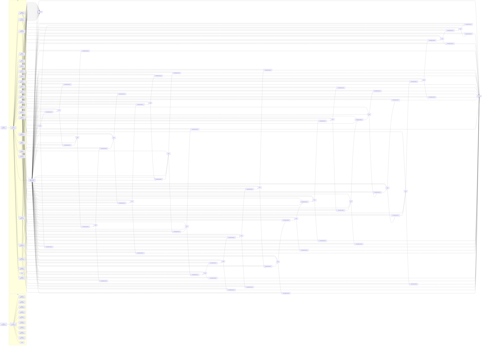

```mermaid
flowchart LR
  subgraph path3 [Path]
    3["Path<br>[422, 459, 0]"]
    5["Segment<br>[465, 505, 0]"]
    6["Segment<br>[511, 562, 0]"]
    7["Segment<br>[568, 604, 0]"]
    8["Segment<br>[610, 662, 0]"]
    9["Segment<br>[668, 733, 0]"]
    10["Segment<br>[739, 791, 0]"]
    11["Segment<br>[797, 855, 0]"]
    12["Segment<br>[861, 912, 0]"]
    13["Segment<br>[918, 960, 0]"]
    14["Segment<br>[966, 1017, 0]"]
    15["Segment<br>[1023, 1059, 0]"]
    16["Segment<br>[1065, 1117, 0]"]
    17["Segment<br>[1123, 1192, 0]"]
    18["Segment<br>[1198, 1251, 0]"]
    19["Segment<br>[1257, 1296, 0]"]
    20["Segment<br>[1302, 1354, 0]"]
    21["Segment<br>[1360, 1402, 0]"]
    22["Segment<br>[1408, 1460, 0]"]
    23["Segment<br>[1466, 1527, 0]"]
    24["Segment<br>[1533, 1586, 0]"]
    25["Segment<br>[1592, 1722, 0]"]
    26["Segment<br>[1728, 1781, 0]"]
    27["Segment<br>[1787, 1826, 0]"]
    28["Segment<br>[1832, 1884, 0]"]
    29["Segment<br>[1890, 1898, 0]"]
    39[Solid2d]
  end
  subgraph path4 [Path]
    4["Path<br>[1931, 1956, 0]"]
    30["Segment<br>[1962, 1981, 0]"]
    31["Segment<br>[1987, 2038, 0]"]
    32["Segment<br>[2044, 2086, 0]"]
    33["Segment<br>[2092, 2144, 0]"]
    34["Segment<br>[2150, 2170, 0]"]
    35["Segment<br>[2176, 2229, 0]"]
    36["Segment<br>[2235, 2280, 0]"]
    37["Segment<br>[2286, 2338, 0]"]
    38["Segment<br>[2344, 2352, 0]"]
    40[Solid2d]
  end
  1["Plane<br>[399, 416, 0]"]
  2["Plane<br>[1908, 1925, 0]"]
  41["Sweep Extrusion<br>[2408, 2429, 0]"]
  42[Wall]
  43[Wall]
  44[Wall]
  45[Wall]
  46[Wall]
  47[Wall]
  48[Wall]
  49[Wall]
  50[Wall]
  51[Wall]
  52[Wall]
  53[Wall]
  54[Wall]
  55[Wall]
  56[Wall]
  57[Wall]
  58[Wall]
  59[Wall]
  60[Wall]
  61[Wall]
  62[Wall]
  63[Wall]
  64[Wall]
  65[Wall]
  66["Cap Start"]
  67["Cap End"]
  68["SweepEdge Opposite"]
  69["SweepEdge Opposite"]
  70["SweepEdge Opposite"]
  71["SweepEdge Opposite"]
  72["SweepEdge Opposite"]
  73["SweepEdge Opposite"]
  74["SweepEdge Opposite"]
  75["SweepEdge Opposite"]
  76["SweepEdge Opposite"]
  77["SweepEdge Opposite"]
  78["SweepEdge Opposite"]
  79["SweepEdge Opposite"]
  80["SweepEdge Opposite"]
  81["SweepEdge Opposite"]
  82["SweepEdge Opposite"]
  83["SweepEdge Opposite"]
  84["SweepEdge Opposite"]
  85["SweepEdge Opposite"]
  86["SweepEdge Opposite"]
  87["SweepEdge Opposite"]
  88["SweepEdge Opposite"]
  89["SweepEdge Opposite"]
  90["SweepEdge Opposite"]
  91["SweepEdge Opposite"]
  92["SweepEdge Adjacent"]
  93["SweepEdge Adjacent"]
  94["SweepEdge Adjacent"]
  95["SweepEdge Adjacent"]
  96["SweepEdge Adjacent"]
  97["SweepEdge Adjacent"]
  98["SweepEdge Adjacent"]
  99["SweepEdge Adjacent"]
  100["SweepEdge Adjacent"]
  101["SweepEdge Adjacent"]
  102["SweepEdge Adjacent"]
  103["SweepEdge Adjacent"]
  104["SweepEdge Adjacent"]
  105["SweepEdge Adjacent"]
  106["SweepEdge Adjacent"]
  107["SweepEdge Adjacent"]
  108["SweepEdge Adjacent"]
  109["SweepEdge Adjacent"]
  110["SweepEdge Adjacent"]
  111["SweepEdge Adjacent"]
  112["SweepEdge Adjacent"]
  113["SweepEdge Adjacent"]
  114["SweepEdge Adjacent"]
  115["SweepEdge Adjacent"]
  1 --- 3
  2 --- 4
  3 --- 5
  3 --- 6
  3 --- 7
  3 --- 8
  3 --- 9
  3 --- 10
  3 --- 11
  3 --- 12
  3 --- 13
  3 --- 14
  3 --- 15
  3 --- 16
  3 --- 17
  3 --- 18
  3 --- 19
  3 --- 20
  3 --- 21
  3 --- 22
  3 --- 23
  3 --- 24
  3 --- 25
  3 --- 26
  3 --- 27
  3 --- 28
  3 --- 29
  3 --- 39
  3 ---- 41
  4 --- 30
  4 --- 31
  4 --- 32
  4 --- 33
  4 --- 34
  4 --- 35
  4 --- 36
  4 --- 37
  4 --- 38
  4 --- 40
  5 --- 61
  5 x--> 66
  5 --- 83
  5 --- 102
  6 --- 53
  6 x--> 66
  6 --- 74
  6 --- 99
  7 --- 52
  7 x--> 66
  7 --- 70
  7 --- 101
  8 --- 57
  8 x--> 66
  8 --- 87
  8 --- 100
  9 --- 48
  9 x--> 66
  9 --- 77
  9 --- 109
  10 --- 47
  10 x--> 66
  10 --- 85
  10 --- 110
  11 --- 60
  11 x--> 66
  11 --- 73
  11 --- 115
  12 --- 64
  12 x--> 66
  12 --- 72
  12 --- 92
  13 --- 63
  13 x--> 66
  13 --- 80
  13 --- 94
  14 --- 45
  14 x--> 66
  14 --- 86
  14 --- 95
  15 --- 46
  15 x--> 66
  15 --- 90
  15 --- 104
  16 --- 65
  16 x--> 66
  16 --- 89
  16 --- 113
  17 --- 58
  17 x--> 66
  17 --- 71
  17 --- 103
  18 --- 50
  18 x--> 66
  18 --- 91
  18 --- 114
  19 --- 43
  19 x--> 66
  19 --- 84
  19 --- 97
  20 --- 59
  20 x--> 66
  20 --- 81
  20 --- 107
  21 --- 44
  21 x--> 66
  21 --- 75
  21 --- 98
  22 --- 62
  22 x--> 66
  22 --- 82
  22 --- 96
  23 --- 42
  23 x--> 66
  23 --- 76
  23 --- 108
  24 --- 55
  24 x--> 66
  24 --- 79
  24 --- 111
  25 --- 56
  25 x--> 66
  25 --- 88
  25 --- 106
  26 --- 51
  26 x--> 66
  26 --- 78
  26 --- 105
  27 --- 54
  27 x--> 66
  27 --- 69
  27 --- 93
  28 --- 49
  28 x--> 66
  28 --- 68
  28 --- 112
  41 --- 42
  41 --- 43
  41 --- 44
  41 --- 45
  41 --- 46
  41 --- 47
  41 --- 48
  41 --- 49
  41 --- 50
  41 --- 51
  41 --- 52
  41 --- 53
  41 --- 54
  41 --- 55
  41 --- 56
  41 --- 57
  41 --- 58
  41 --- 59
  41 --- 60
  41 --- 61
  41 --- 62
  41 --- 63
  41 --- 64
  41 --- 65
  41 --- 66
  41 --- 67
  41 --- 68
  41 --- 69
  41 --- 70
  41 --- 71
  41 --- 72
  41 --- 73
  41 --- 74
  41 --- 75
  41 --- 76
  41 --- 77
  41 --- 78
  41 --- 79
  41 --- 80
  41 --- 81
  41 --- 82
  41 --- 83
  41 --- 84
  41 --- 85
  41 --- 86
  41 --- 87
  41 --- 88
  41 --- 89
  41 --- 90
  41 --- 91
  41 --- 92
  41 --- 93
  41 --- 94
  41 --- 95
  41 --- 96
  41 --- 97
  41 --- 98
  41 --- 99
  41 --- 100
  41 --- 101
  41 --- 102
  41 --- 103
  41 --- 104
  41 --- 105
  41 --- 106
  41 --- 107
  41 --- 108
  41 --- 109
  41 --- 110
  41 --- 111
  41 --- 112
  41 --- 113
  41 --- 114
  41 --- 115
  42 --- 76
  96 <--x 42
  42 --- 108
  43 --- 84
  43 --- 97
  114 <--x 43
  44 --- 75
  44 --- 98
  107 <--x 44
  45 --- 86
  94 <--x 45
  45 --- 95
  46 --- 90
  95 <--x 46
  46 --- 104
  47 --- 85
  109 <--x 47
  47 --- 110
  48 --- 77
  100 <--x 48
  48 --- 109
  49 --- 68
  93 <--x 49
  49 --- 112
  50 --- 91
  103 <--x 50
  50 --- 114
  51 --- 78
  51 --- 105
  106 <--x 51
  52 --- 70
  99 <--x 52
  52 --- 101
  53 --- 74
  53 --- 99
  102 <--x 53
  54 --- 69
  54 --- 93
  105 <--x 54
  55 --- 79
  108 <--x 55
  55 --- 111
  56 --- 88
  56 --- 106
  111 <--x 56
  57 --- 87
  57 --- 100
  101 <--x 57
  58 --- 71
  58 --- 103
  113 <--x 58
  59 --- 81
  97 <--x 59
  59 --- 107
  60 --- 73
  110 <--x 60
  60 --- 115
  61 --- 83
  61 --- 102
  112 <--x 61
  62 --- 82
  62 --- 96
  98 <--x 62
  63 --- 80
  92 <--x 63
  63 --- 94
  64 --- 72
  64 --- 92
  115 <--x 64
  65 --- 89
  104 <--x 65
  65 --- 113
  68 <--x 67
  69 <--x 67
  70 <--x 67
  71 <--x 67
  72 <--x 67
  73 <--x 67
  74 <--x 67
  75 <--x 67
  76 <--x 67
  77 <--x 67
  78 <--x 67
  79 <--x 67
  80 <--x 67
  81 <--x 67
  82 <--x 67
  83 <--x 67
  84 <--x 67
  85 <--x 67
  86 <--x 67
  87 <--x 67
  88 <--x 67
  89 <--x 67
  90 <--x 67
  91 <--x 67
```
