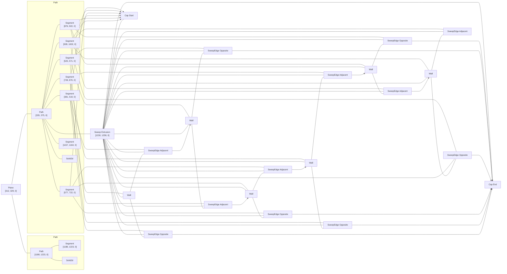

```mermaid
flowchart LR
  subgraph path2 [Path]
    2["Path<br>[335, 375, 0]"]
    4["Segment<br>[381, 519, 0]"]
    5["Segment<br>[525, 571, 0]"]
    6["Segment<br>[577, 722, 0]"]
    7["Segment<br>[728, 870, 0]"]
    8["Segment<br>[876, 922, 0]"]
    9["Segment<br>[928, 1002, 0]"]
    10["Segment<br>[1157, 1164, 0]"]
    13[Solid2d]
  end
  subgraph path3 [Path]
    3["Path<br>[1188, 1223, 0]"]
    11["Segment<br>[1188, 1223, 0]"]
    12[Solid2d]
  end
  1["Plane<br>[312, 329, 0]"]
  14["Sweep Extrusion<br>[1230, 1258, 0]"]
  15[Wall]
  16[Wall]
  17[Wall]
  18[Wall]
  19[Wall]
  20[Wall]
  21["Cap Start"]
  22["Cap End"]
  23["SweepEdge Opposite"]
  24["SweepEdge Opposite"]
  25["SweepEdge Opposite"]
  26["SweepEdge Opposite"]
  27["SweepEdge Opposite"]
  28["SweepEdge Opposite"]
  29["SweepEdge Adjacent"]
  30["SweepEdge Adjacent"]
  31["SweepEdge Adjacent"]
  32["SweepEdge Adjacent"]
  33["SweepEdge Adjacent"]
  34["SweepEdge Adjacent"]
  1 --- 2
  1 --- 3
  2 --- 4
  2 --- 5
  2 --- 6
  2 --- 7
  2 --- 8
  2 --- 9
  2 --- 10
  2 --- 13
  2 ---- 14
  3 --- 11
  3 --- 12
  4 --- 20
  4 x--> 21
  4 --- 28
  4 --- 32
  5 --- 18
  5 x--> 21
  5 --- 24
  5 --- 31
  6 --- 17
  6 x--> 21
  6 --- 26
  6 --- 29
  7 --- 19
  7 x--> 21
  7 --- 27
  7 --- 33
  8 --- 16
  8 x--> 21
  8 --- 23
  8 --- 30
  9 --- 15
  9 x--> 21
  9 --- 25
  9 --- 34
  14 --- 15
  14 --- 16
  14 --- 17
  14 --- 18
  14 --- 19
  14 --- 20
  14 --- 21
  14 --- 22
  14 --- 23
  14 --- 24
  14 --- 25
  14 --- 26
  14 --- 27
  14 --- 28
  14 --- 29
  14 --- 30
  14 --- 31
  14 --- 32
  14 --- 33
  14 --- 34
  15 --- 25
  30 <--x 15
  15 --- 34
  16 --- 23
  16 --- 30
  33 <--x 16
  17 --- 26
  17 --- 29
  31 <--x 17
  18 --- 24
  18 --- 31
  32 <--x 18
  19 --- 27
  29 <--x 19
  19 --- 33
  20 --- 28
  20 --- 32
  23 <--x 22
  24 <--x 22
  25 <--x 22
  26 <--x 22
  27 <--x 22
  28 <--x 22
```
