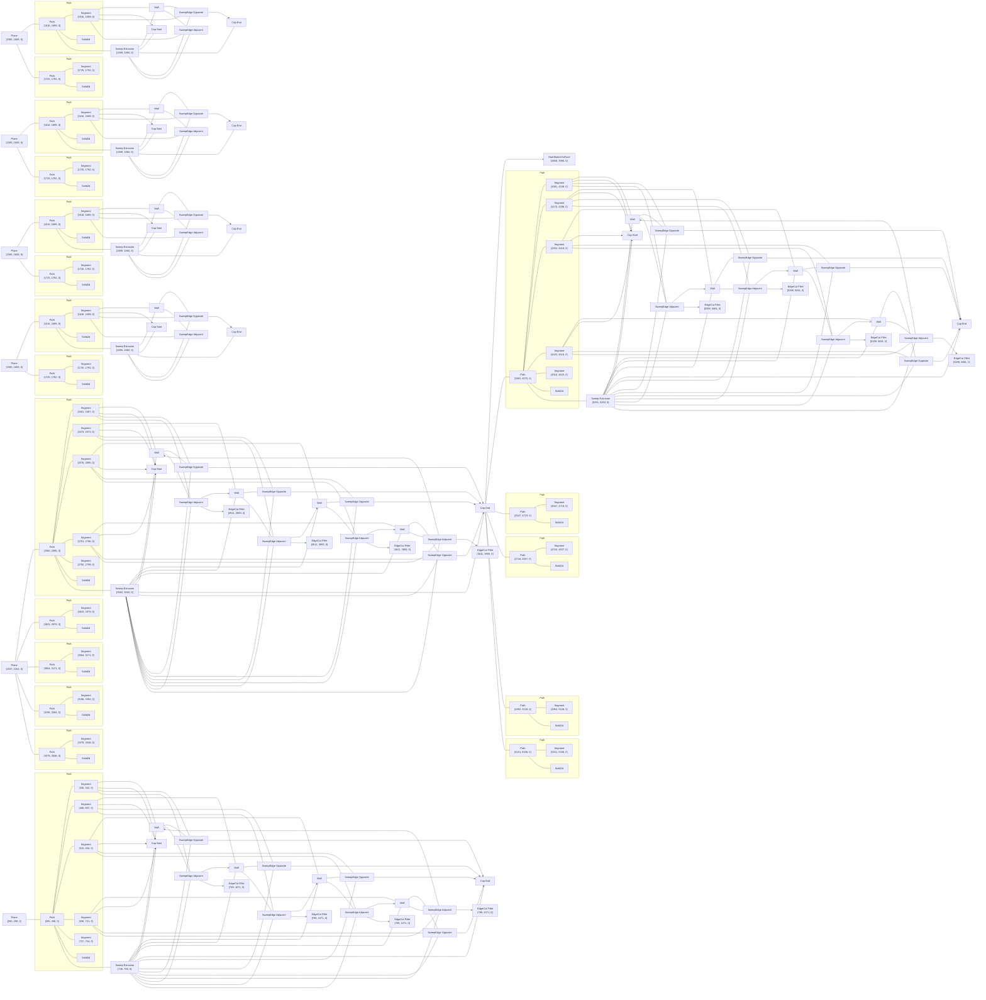

```mermaid
flowchart LR
  subgraph path8 [Path]
    8["Path<br>[305, 330, 0]"]
    27["Segment<br>[336, 402, 0]"]
    28["Segment<br>[408, 507, 0]"]
    29["Segment<br>[513, 630, 0]"]
    30["Segment<br>[636, 721, 0]"]
    31["Segment<br>[727, 734, 0]"]
    64[Solid2d]
  end
  subgraph path9 [Path]
    9["Path<br>[1616, 1699, 0]"]
    33["Segment<br>[1616, 1699, 0]"]
    58[Solid2d]
  end
  subgraph path10 [Path]
    10["Path<br>[1616, 1699, 0]"]
    32["Segment<br>[1616, 1699, 0]"]
    60[Solid2d]
  end
  subgraph path11 [Path]
    11["Path<br>[1616, 1699, 0]"]
    35["Segment<br>[1616, 1699, 0]"]
    66[Solid2d]
  end
  subgraph path12 [Path]
    12["Path<br>[1616, 1699, 0]"]
    34["Segment<br>[1616, 1699, 0]"]
    73[Solid2d]
  end
  subgraph path13 [Path]
    13["Path<br>[1725, 1792, 0]"]
    38["Segment<br>[1725, 1792, 0]"]
    62[Solid2d]
  end
  subgraph path14 [Path]
    14["Path<br>[1725, 1792, 0]"]
    39["Segment<br>[1725, 1792, 0]"]
    71[Solid2d]
  end
  subgraph path15 [Path]
    15["Path<br>[1725, 1792, 0]"]
    37["Segment<br>[1725, 1792, 0]"]
    72[Solid2d]
  end
  subgraph path16 [Path]
    16["Path<br>[1725, 1792, 0]"]
    36["Segment<br>[1725, 1792, 0]"]
    74[Solid2d]
  end
  subgraph path17 [Path]
    17["Path<br>[2360, 2395, 0]"]
    40["Segment<br>[2401, 2467, 0]"]
    41["Segment<br>[2473, 2572, 0]"]
    42["Segment<br>[2578, 2695, 0]"]
    43["Segment<br>[2701, 2786, 0]"]
    44["Segment<br>[2792, 2799, 0]"]
    63[Solid2d]
  end
  subgraph path18 [Path]
    18["Path<br>[2823, 2979, 0]"]
    45["Segment<br>[2823, 2979, 0]"]
    65[Solid2d]
  end
  subgraph path19 [Path]
    19["Path<br>[3004, 3171, 0]"]
    46["Segment<br>[3004, 3171, 0]"]
    68[Solid2d]
  end
  subgraph path20 [Path]
    20["Path<br>[3196, 3354, 0]"]
    47["Segment<br>[3196, 3354, 0]"]
    67[Solid2d]
  end
  subgraph path21 [Path]
    21["Path<br>[3379, 3548, 0]"]
    48["Segment<br>[3379, 3548, 0]"]
    70[Solid2d]
  end
  subgraph path22 [Path]
    22["Path<br>[3991, 4075, 0]"]
    49["Segment<br>[4081, 4169, 0]"]
    50["Segment<br>[4175, 4296, 0]"]
    51["Segment<br>[4302, 4419, 0]"]
    52["Segment<br>[4425, 4510, 0]"]
    53["Segment<br>[4516, 4523, 0]"]
    59[Solid2d]
  end
  subgraph path23 [Path]
    23["Path<br>[4547, 4719, 0]"]
    54["Segment<br>[4547, 4719, 0]"]
    61[Solid2d]
  end
  subgraph path24 [Path]
    24["Path<br>[4744, 4927, 0]"]
    55["Segment<br>[4744, 4927, 0]"]
    69[Solid2d]
  end
  subgraph path25 [Path]
    25["Path<br>[4952, 5126, 0]"]
    56["Segment<br>[4952, 5126, 0]"]
    75[Solid2d]
  end
  subgraph path26 [Path]
    26["Path<br>[5151, 5336, 0]"]
    57["Segment<br>[5151, 5336, 0]"]
    76[Solid2d]
  end
  1["Plane<br>[282, 299, 0]"]
  2["Plane<br>[1585, 1608, 0]"]
  3["Plane<br>[1585, 1608, 0]"]
  4["Plane<br>[1585, 1608, 0]"]
  5["Plane<br>[1585, 1608, 0]"]
  6["Plane<br>[2337, 2354, 0]"]
  7["StartSketchOnFace<br>[3948, 3985, 0]"]
  77["Sweep Extrusion<br>[748, 783, 0]"]
  78["Sweep Extrusion<br>[1809, 1860, 0]"]
  79["Sweep Extrusion<br>[1809, 1860, 0]"]
  80["Sweep Extrusion<br>[1809, 1860, 0]"]
  81["Sweep Extrusion<br>[1809, 1860, 0]"]
  82["Sweep Extrusion<br>[3563, 3605, 0]"]
  83["Sweep Extrusion<br>[5351, 5393, 0]"]
  84[Wall]
  85[Wall]
  86[Wall]
  87[Wall]
  88[Wall]
  89[Wall]
  90[Wall]
  91[Wall]
  92[Wall]
  93[Wall]
  94[Wall]
  95[Wall]
  96[Wall]
  97[Wall]
  98[Wall]
  99[Wall]
  100["Cap Start"]
  101["Cap Start"]
  102["Cap Start"]
  103["Cap Start"]
  104["Cap Start"]
  105["Cap Start"]
  106["Cap Start"]
  107["Cap End"]
  108["Cap End"]
  109["Cap End"]
  110["Cap End"]
  111["Cap End"]
  112["Cap End"]
  113["Cap End"]
  114["SweepEdge Opposite"]
  115["SweepEdge Opposite"]
  116["SweepEdge Opposite"]
  117["SweepEdge Opposite"]
  118["SweepEdge Opposite"]
  119["SweepEdge Opposite"]
  120["SweepEdge Opposite"]
  121["SweepEdge Opposite"]
  122["SweepEdge Opposite"]
  123["SweepEdge Opposite"]
  124["SweepEdge Opposite"]
  125["SweepEdge Opposite"]
  126["SweepEdge Opposite"]
  127["SweepEdge Opposite"]
  128["SweepEdge Opposite"]
  129["SweepEdge Opposite"]
  130["SweepEdge Adjacent"]
  131["SweepEdge Adjacent"]
  132["SweepEdge Adjacent"]
  133["SweepEdge Adjacent"]
  134["SweepEdge Adjacent"]
  135["SweepEdge Adjacent"]
  136["SweepEdge Adjacent"]
  137["SweepEdge Adjacent"]
  138["SweepEdge Adjacent"]
  139["SweepEdge Adjacent"]
  140["SweepEdge Adjacent"]
  141["SweepEdge Adjacent"]
  142["SweepEdge Adjacent"]
  143["SweepEdge Adjacent"]
  144["SweepEdge Adjacent"]
  145["SweepEdge Adjacent"]
  146["EdgeCut Fillet<br>[789, 1071, 0]"]
  147["EdgeCut Fillet<br>[789, 1071, 0]"]
  148["EdgeCut Fillet<br>[789, 1071, 0]"]
  149["EdgeCut Fillet<br>[789, 1071, 0]"]
  150["EdgeCut Fillet<br>[3611, 3893, 0]"]
  151["EdgeCut Fillet<br>[3611, 3893, 0]"]
  152["EdgeCut Fillet<br>[3611, 3893, 0]"]
  153["EdgeCut Fillet<br>[3611, 3893, 0]"]
  154["EdgeCut Fillet<br>[5399, 5681, 0]"]
  155["EdgeCut Fillet<br>[5399, 5681, 0]"]
  156["EdgeCut Fillet<br>[5399, 5681, 0]"]
  157["EdgeCut Fillet<br>[5399, 5681, 0]"]
  1 --- 8
  2 --- 10
  2 --- 13
  3 --- 9
  3 --- 15
  4 --- 11
  4 --- 16
  5 --- 12
  5 --- 14
  6 --- 17
  6 --- 18
  6 --- 19
  6 --- 20
  6 --- 21
  107 x--> 7
  8 --- 27
  8 --- 28
  8 --- 29
  8 --- 30
  8 --- 31
  8 --- 64
  8 ---- 77
  9 --- 33
  9 --- 58
  9 ---- 81
  10 --- 32
  10 --- 60
  10 ---- 79
  11 --- 35
  11 --- 66
  11 ---- 80
  12 --- 34
  12 --- 73
  12 ---- 78
  13 --- 38
  13 --- 62
  14 --- 39
  14 --- 71
  15 --- 37
  15 --- 72
  16 --- 36
  16 --- 74
  17 --- 40
  17 --- 41
  17 --- 42
  17 --- 43
  17 --- 44
  17 --- 63
  17 ---- 82
  18 --- 45
  18 --- 65
  19 --- 46
  19 --- 68
  20 --- 47
  20 --- 67
  21 --- 48
  21 --- 70
  22 --- 49
  22 --- 50
  22 --- 51
  22 --- 52
  22 --- 53
  22 --- 59
  22 ---- 83
  107 --- 22
  23 --- 54
  23 --- 61
  107 --- 23
  24 --- 55
  24 --- 69
  107 --- 24
  25 --- 56
  25 --- 75
  107 --- 25
  26 --- 57
  26 --- 76
  107 --- 26
  27 --- 88
  27 x--> 103
  27 --- 117
  27 --- 132
  28 --- 86
  28 x--> 103
  28 --- 116
  28 --- 133
  29 --- 85
  29 x--> 103
  29 --- 115
  29 --- 134
  30 --- 87
  30 x--> 103
  30 --- 118
  30 --- 131
  32 --- 93
  32 x--> 102
  32 --- 123
  32 --- 139
  33 --- 99
  33 x--> 104
  33 --- 129
  33 --- 145
  34 --- 84
  34 x--> 105
  34 --- 114
  34 --- 130
  35 --- 98
  35 x--> 106
  35 --- 128
  35 --- 144
  40 --- 92
  40 x--> 100
  40 --- 120
  40 --- 137
  41 --- 90
  41 x--> 100
  41 --- 122
  41 --- 136
  42 --- 89
  42 x--> 100
  42 --- 121
  42 --- 135
  43 --- 91
  43 x--> 100
  43 --- 119
  43 --- 138
  49 --- 96
  49 x--> 101
  49 --- 125
  49 --- 141
  50 --- 97
  50 x--> 101
  50 --- 124
  50 --- 140
  51 --- 95
  51 x--> 101
  51 --- 126
  51 --- 142
  52 --- 94
  52 x--> 101
  52 --- 127
  52 --- 143
  77 --- 85
  77 --- 86
  77 --- 87
  77 --- 88
  77 --- 103
  77 --- 110
  77 --- 115
  77 --- 116
  77 --- 117
  77 --- 118
  77 --- 131
  77 --- 132
  77 --- 133
  77 --- 134
  78 --- 84
  78 --- 105
  78 --- 112
  78 --- 114
  78 --- 130
  79 --- 93
  79 --- 102
  79 --- 109
  79 --- 123
  79 --- 139
  80 --- 98
  80 --- 106
  80 --- 113
  80 --- 128
  80 --- 144
  81 --- 99
  81 --- 104
  81 --- 111
  81 --- 129
  81 --- 145
  82 --- 89
  82 --- 90
  82 --- 91
  82 --- 92
  82 --- 100
  82 --- 107
  82 --- 119
  82 --- 120
  82 --- 121
  82 --- 122
  82 --- 135
  82 --- 136
  82 --- 137
  82 --- 138
  83 --- 94
  83 --- 95
  83 --- 96
  83 --- 97
  83 --- 101
  83 --- 108
  83 --- 124
  83 --- 125
  83 --- 126
  83 --- 127
  83 --- 140
  83 --- 141
  83 --- 142
  83 --- 143
  84 --- 114
  84 --- 130
  85 --- 115
  133 <--x 85
  85 --- 134
  86 --- 116
  132 <--x 86
  86 --- 133
  87 --- 118
  87 --- 131
  134 <--x 87
  88 --- 117
  131 <--x 88
  88 --- 132
  89 --- 121
  89 --- 135
  136 <--x 89
  90 --- 122
  90 --- 136
  137 <--x 90
  91 --- 119
  135 <--x 91
  91 --- 138
  92 --- 120
  92 --- 137
  138 <--x 92
  93 --- 123
  93 --- 139
  94 --- 127
  142 <--x 94
  94 --- 143
  95 --- 126
  140 <--x 95
  95 --- 142
  96 --- 125
  96 --- 141
  143 <--x 96
  97 --- 124
  97 --- 140
  141 <--x 97
  98 --- 128
  98 --- 144
  99 --- 129
  99 --- 145
  119 <--x 107
  120 <--x 107
  121 <--x 107
  122 <--x 107
  124 <--x 108
  125 <--x 108
  126 <--x 108
  127 <--x 108
  123 <--x 109
  115 <--x 110
  116 <--x 110
  117 <--x 110
  118 <--x 110
  129 <--x 111
  114 <--x 112
  128 <--x 113
  131 <--x 147
  132 <--x 148
  133 <--x 149
  134 <--x 146
  135 <--x 151
  136 <--x 152
  137 <--x 150
  138 <--x 153
  140 <--x 156
  141 <--x 157
  142 <--x 154
  143 <--x 155
```
