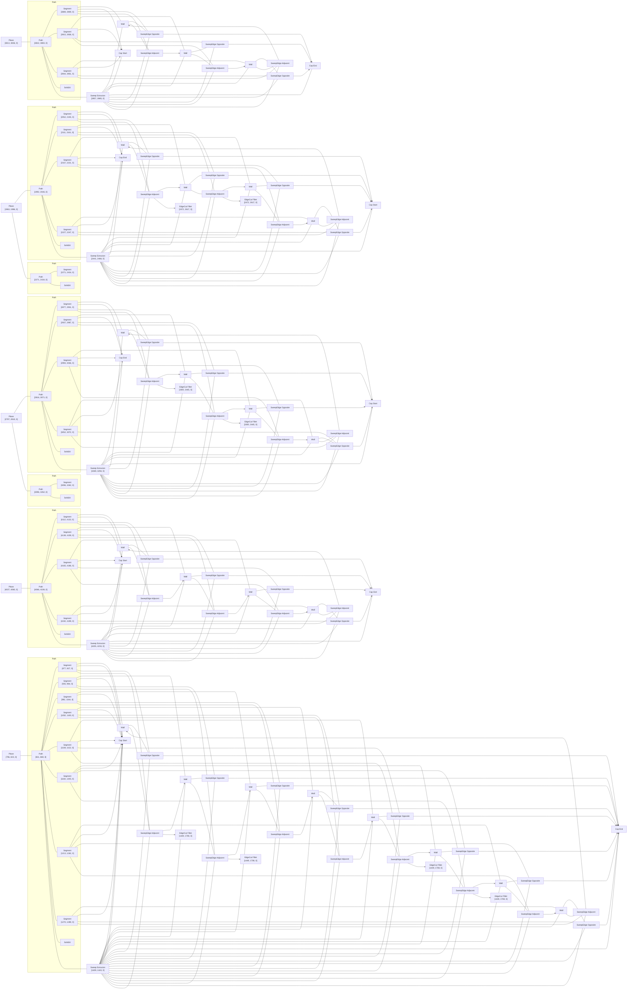

```mermaid
flowchart LR
  subgraph path6 [Path]
    6["Path<br>[831, 869, 0]"]
    13["Segment<br>[877, 927, 0]"]
    14["Segment<br>[935, 984, 0]"]
    15["Segment<br>[992, 1044, 0]"]
    16["Segment<br>[1052, 1100, 0]"]
    17["Segment<br>[1108, 1152, 0]"]
    18["Segment<br>[1160, 1205, 0]"]
    19["Segment<br>[1213, 1262, 0]"]
    20["Segment<br>[1270, 1289, 0]"]
    40[Solid2d]
  end
  subgraph path7 [Path]
    7["Path<br>[1992, 2046, 0]"]
    21["Segment<br>[2052, 2105, 0]"]
    22["Segment<br>[2111, 2161, 0]"]
    23["Segment<br>[2167, 2221, 0]"]
    24["Segment<br>[2227, 2247, 0]"]
    39[Solid2d]
  end
  subgraph path8 [Path]
    8["Path<br>[2271, 2434, 0]"]
    25["Segment<br>[2271, 2434, 0]"]
    44[Solid2d]
  end
  subgraph path9 [Path]
    9["Path<br>[2816, 2871, 0]"]
    26["Segment<br>[2877, 2931, 0]"]
    27["Segment<br>[2937, 2987, 0]"]
    28["Segment<br>[2993, 3046, 0]"]
    29["Segment<br>[3052, 3072, 0]"]
    42[Solid2d]
  end
  subgraph path10 [Path]
    10["Path<br>[3096, 3262, 0]"]
    30["Segment<br>[3096, 3262, 0]"]
    38[Solid2d]
  end
  subgraph path11 [Path]
    11["Path<br>[3842, 3883, 0]"]
    31["Segment<br>[3889, 3909, 0]"]
    32["Segment<br>[3915, 3938, 0]"]
    33["Segment<br>[3944, 3951, 0]"]
    43[Solid2d]
  end
  subgraph path12 [Path]
    12["Path<br>[4066, 4106, 0]"]
    34["Segment<br>[4112, 4132, 0]"]
    35["Segment<br>[4138, 4159, 0]"]
    36["Segment<br>[4165, 4186, 0]"]
    37["Segment<br>[4192, 4199, 0]"]
    41[Solid2d]
  end
  1["Plane<br>[796, 823, 0]"]
  2["Plane<br>[1963, 1986, 0]"]
  3["Plane<br>[2787, 2810, 0]"]
  4["Plane<br>[3813, 3836, 0]"]
  5["Plane<br>[4037, 4060, 0]"]
  45["Sweep Extrusion<br>[1409, 1443, 0]"]
  46["Sweep Extrusion<br>[2441, 2466, 0]"]
  47["Sweep Extrusion<br>[3269, 3294, 0]"]
  48["Sweep Extrusion<br>[3957, 3985, 0]"]
  49["Sweep Extrusion<br>[4205, 4233, 0]"]
  50[Wall]
  51[Wall]
  52[Wall]
  53[Wall]
  54[Wall]
  55[Wall]
  56[Wall]
  57[Wall]
  58[Wall]
  59[Wall]
  60[Wall]
  61[Wall]
  62[Wall]
  63[Wall]
  64[Wall]
  65[Wall]
  66[Wall]
  67[Wall]
  68[Wall]
  69[Wall]
  70[Wall]
  71[Wall]
  72[Wall]
  73["Cap Start"]
  74["Cap Start"]
  75["Cap Start"]
  76["Cap Start"]
  77["Cap Start"]
  78["Cap End"]
  79["Cap End"]
  80["Cap End"]
  81["Cap End"]
  82["Cap End"]
  83["SweepEdge Opposite"]
  84["SweepEdge Opposite"]
  85["SweepEdge Opposite"]
  86["SweepEdge Opposite"]
  87["SweepEdge Opposite"]
  88["SweepEdge Opposite"]
  89["SweepEdge Opposite"]
  90["SweepEdge Opposite"]
  91["SweepEdge Opposite"]
  92["SweepEdge Opposite"]
  93["SweepEdge Opposite"]
  94["SweepEdge Opposite"]
  95["SweepEdge Opposite"]
  96["SweepEdge Opposite"]
  97["SweepEdge Opposite"]
  98["SweepEdge Opposite"]
  99["SweepEdge Opposite"]
  100["SweepEdge Opposite"]
  101["SweepEdge Opposite"]
  102["SweepEdge Opposite"]
  103["SweepEdge Opposite"]
  104["SweepEdge Opposite"]
  105["SweepEdge Opposite"]
  106["SweepEdge Adjacent"]
  107["SweepEdge Adjacent"]
  108["SweepEdge Adjacent"]
  109["SweepEdge Adjacent"]
  110["SweepEdge Adjacent"]
  111["SweepEdge Adjacent"]
  112["SweepEdge Adjacent"]
  113["SweepEdge Adjacent"]
  114["SweepEdge Adjacent"]
  115["SweepEdge Adjacent"]
  116["SweepEdge Adjacent"]
  117["SweepEdge Adjacent"]
  118["SweepEdge Adjacent"]
  119["SweepEdge Adjacent"]
  120["SweepEdge Adjacent"]
  121["SweepEdge Adjacent"]
  122["SweepEdge Adjacent"]
  123["SweepEdge Adjacent"]
  124["SweepEdge Adjacent"]
  125["SweepEdge Adjacent"]
  126["SweepEdge Adjacent"]
  127["SweepEdge Adjacent"]
  128["SweepEdge Adjacent"]
  129["EdgeCut Fillet<br>[1449, 1708, 0]"]
  130["EdgeCut Fillet<br>[1449, 1708, 0]"]
  131["EdgeCut Fillet<br>[1449, 1708, 0]"]
  132["EdgeCut Fillet<br>[1449, 1708, 0]"]
  133["EdgeCut Fillet<br>[2472, 2617, 0]"]
  134["EdgeCut Fillet<br>[2472, 2617, 0]"]
  135["EdgeCut Fillet<br>[3300, 3445, 0]"]
  136["EdgeCut Fillet<br>[3300, 3445, 0]"]
  1 --- 6
  2 --- 7
  2 --- 8
  3 --- 9
  3 --- 10
  4 --- 11
  5 --- 12
  6 --- 13
  6 --- 14
  6 --- 15
  6 --- 16
  6 --- 17
  6 --- 18
  6 --- 19
  6 --- 20
  6 --- 40
  6 ---- 45
  7 --- 21
  7 --- 22
  7 --- 23
  7 --- 24
  7 --- 39
  7 ---- 46
  8 --- 25
  8 --- 44
  9 --- 26
  9 --- 27
  9 --- 28
  9 --- 29
  9 --- 42
  9 ---- 47
  10 --- 30
  10 --- 38
  11 --- 31
  11 --- 32
  11 --- 33
  11 --- 43
  11 ---- 48
  12 --- 34
  12 --- 35
  12 --- 36
  12 --- 37
  12 --- 41
  12 ---- 49
  13 --- 53
  13 x--> 73
  13 --- 83
  13 --- 113
  14 --- 54
  14 x--> 73
  14 --- 86
  14 --- 111
  15 --- 52
  15 x--> 73
  15 --- 89
  15 --- 108
  16 --- 51
  16 x--> 73
  16 --- 90
  16 --- 110
  17 --- 55
  17 x--> 73
  17 --- 85
  17 --- 106
  18 --- 57
  18 x--> 73
  18 --- 84
  18 --- 109
  19 --- 56
  19 x--> 73
  19 --- 88
  19 --- 107
  20 --- 50
  20 x--> 73
  20 --- 87
  20 --- 112
  21 --- 63
  21 x--> 80
  21 --- 98
  21 --- 120
  22 --- 65
  22 x--> 80
  22 --- 95
  22 --- 118
  23 --- 62
  23 x--> 80
  23 --- 96
  23 --- 119
  24 --- 64
  24 x--> 80
  24 --- 97
  24 --- 121
  26 --- 69
  26 x--> 79
  26 --- 102
  26 --- 126
  27 --- 70
  27 x--> 79
  27 --- 105
  27 --- 128
  28 --- 72
  28 x--> 79
  28 --- 104
  28 --- 127
  29 --- 71
  29 x--> 79
  29 --- 103
  29 --- 125
  31 --- 66
  31 x--> 76
  31 --- 100
  31 --- 124
  32 --- 68
  32 x--> 76
  32 --- 101
  32 --- 122
  33 --- 67
  33 x--> 76
  33 --- 99
  33 --- 123
  34 --- 60
  34 x--> 77
  34 --- 92
  34 --- 115
  35 --- 58
  35 x--> 77
  35 --- 94
  35 --- 117
  36 --- 61
  36 x--> 77
  36 --- 93
  36 --- 114
  37 --- 59
  37 x--> 77
  37 --- 91
  37 --- 116
  45 --- 50
  45 --- 51
  45 --- 52
  45 --- 53
  45 --- 54
  45 --- 55
  45 --- 56
  45 --- 57
  45 --- 73
  45 --- 78
  45 --- 83
  45 --- 84
  45 --- 85
  45 --- 86
  45 --- 87
  45 --- 88
  45 --- 89
  45 --- 90
  45 --- 106
  45 --- 107
  45 --- 108
  45 --- 109
  45 --- 110
  45 --- 111
  45 --- 112
  45 --- 113
  46 --- 62
  46 --- 63
  46 --- 64
  46 --- 65
  46 --- 75
  46 --- 80
  46 --- 95
  46 --- 96
  46 --- 97
  46 --- 98
  46 --- 118
  46 --- 119
  46 --- 120
  46 --- 121
  47 --- 69
  47 --- 70
  47 --- 71
  47 --- 72
  47 --- 74
  47 --- 79
  47 --- 102
  47 --- 103
  47 --- 104
  47 --- 105
  47 --- 125
  47 --- 126
  47 --- 127
  47 --- 128
  48 --- 66
  48 --- 67
  48 --- 68
  48 --- 76
  48 --- 81
  48 --- 99
  48 --- 100
  48 --- 101
  48 --- 122
  48 --- 123
  48 --- 124
  49 --- 58
  49 --- 59
  49 --- 60
  49 --- 61
  49 --- 77
  49 --- 82
  49 --- 91
  49 --- 92
  49 --- 93
  49 --- 94
  49 --- 114
  49 --- 115
  49 --- 116
  49 --- 117
  50 --- 87
  107 <--x 50
  50 --- 112
  51 --- 90
  108 <--x 51
  51 --- 110
  52 --- 89
  52 --- 108
  111 <--x 52
  53 --- 83
  112 <--x 53
  53 --- 113
  54 --- 86
  54 --- 111
  113 <--x 54
  55 --- 85
  55 --- 106
  110 <--x 55
  56 --- 88
  56 --- 107
  109 <--x 56
  57 --- 84
  106 <--x 57
  57 --- 109
  58 --- 94
  115 <--x 58
  58 --- 117
  59 --- 91
  114 <--x 59
  59 --- 116
  60 --- 92
  60 --- 115
  116 <--x 60
  61 --- 93
  61 --- 114
  117 <--x 61
  62 --- 96
  118 <--x 62
  62 --- 119
  63 --- 98
  63 --- 120
  121 <--x 63
  64 --- 97
  119 <--x 64
  64 --- 121
  65 --- 95
  65 --- 118
  120 <--x 65
  66 --- 100
  123 <--x 66
  66 --- 124
  67 --- 99
  122 <--x 67
  67 --- 123
  68 --- 101
  68 --- 122
  124 <--x 68
  69 --- 102
  125 <--x 69
  69 --- 126
  70 --- 105
  126 <--x 70
  70 --- 128
  71 --- 103
  71 --- 125
  127 <--x 71
  72 --- 104
  72 --- 127
  128 <--x 72
  102 <--x 74
  103 <--x 74
  104 <--x 74
  105 <--x 74
  95 <--x 75
  96 <--x 75
  97 <--x 75
  98 <--x 75
  83 <--x 78
  84 <--x 78
  85 <--x 78
  86 <--x 78
  87 <--x 78
  88 <--x 78
  89 <--x 78
  90 <--x 78
  99 <--x 81
  100 <--x 81
  101 <--x 81
  91 <--x 82
  92 <--x 82
  93 <--x 82
  94 <--x 82
  106 <--x 130
  109 <--x 129
  111 <--x 131
  113 <--x 132
  118 <--x 134
  120 <--x 133
  126 <--x 135
  128 <--x 136
```
