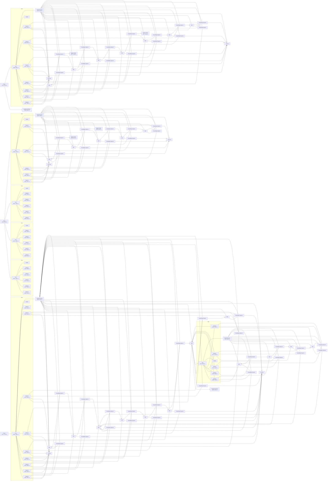

```mermaid
flowchart LR
  subgraph path6 [Path]
    6["Path<br>[1017, 1061, 0]"]
    15["Segment<br>[1069, 1109, 0]"]
    20["Segment<br>[1117, 1163, 0]"]
    21["Segment<br>[1171, 1212, 0]"]
    25["Segment<br>[1220, 1285, 0]"]
    32["Segment<br>[1293, 1300, 0]"]
    54[Solid2d]
  end
  subgraph path7 [Path]
    7["Path<br>[1017, 1061, 0]"]
    16["Segment<br>[1069, 1109, 0]"]
    17["Segment<br>[1117, 1163, 0]"]
    23["Segment<br>[1171, 1212, 0]"]
    26["Segment<br>[1220, 1285, 0]"]
    29["Segment<br>[1293, 1300, 0]"]
    56[Solid2d]
  end
  subgraph path8 [Path]
    8["Path<br>[1017, 1061, 0]"]
    13["Segment<br>[1069, 1109, 0]"]
    19["Segment<br>[1117, 1163, 0]"]
    22["Segment<br>[1171, 1212, 0]"]
    27["Segment<br>[1220, 1285, 0]"]
    31["Segment<br>[1293, 1300, 0]"]
    59[Solid2d]
  end
  subgraph path9 [Path]
    9["Path<br>[1017, 1061, 0]"]
    14["Segment<br>[1069, 1109, 0]"]
    18["Segment<br>[1117, 1163, 0]"]
    24["Segment<br>[1171, 1212, 0]"]
    28["Segment<br>[1220, 1285, 0]"]
    30["Segment<br>[1293, 1300, 0]"]
    60[Solid2d]
  end
  subgraph path10 [Path]
    10["Path<br>[1462, 1519, 0]"]
    33["Segment<br>[1525, 1557, 0]"]
    34["Segment<br>[1563, 1600, 0]"]
    35["Segment<br>[1606, 1639, 0]"]
    36["Segment<br>[1645, 1712, 0]"]
    37["Segment<br>[1718, 1725, 0]"]
    57[Solid2d]
  end
  subgraph path11 [Path]
    11["Path<br>[2885, 2941, 0]"]
    38["Segment<br>[2947, 3006, 0]"]
    39["Segment<br>[3012, 3047, 0]"]
    40["Segment<br>[3053, 3086, 0]"]
    41["Segment<br>[3092, 3151, 0]"]
    42["Segment<br>[3157, 3193, 0]"]
    43["Segment<br>[3199, 3223, 0]"]
    44["Segment<br>[3229, 3236, 0]"]
    58[Solid2d]
  end
  subgraph path12 [Path]
    12["Path<br>[3831, 3881, 0]"]
    45["Segment<br>[3887, 3937, 0]"]
    46["Segment<br>[3943, 4009, 0]"]
    47["Segment<br>[4015, 4066, 0]"]
    48["Segment<br>[4072, 4137, 0]"]
    49["Segment<br>[4143, 4196, 0]"]
    50["Segment<br>[4202, 4269, 0]"]
    51["Segment<br>[4275, 4349, 0]"]
    52["Segment<br>[4355, 4423, 0]"]
    53["Segment<br>[4429, 4436, 0]"]
    55[Solid2d]
  end
  1["Plane<br>[1391, 1408, 0]"]
  2["Plane<br>[2782, 2824, 0]"]
  3["Plane<br>[3757, 3783, 0]"]
  4["StartSketchOnPlane<br>[2768, 2825, 0]"]
  5["StartSketchOnFace<br>[4593, 4632, 0]"]
  61["Sweep Extrusion<br>[2459, 2509, 0]"]
  62["Sweep Extrusion<br>[3270, 3314, 0]"]
  63["Sweep Extrusion<br>[4492, 4534, 0]"]
  64["Sweep Extrusion<br>[4812, 4862, 0]"]
  65[Wall]
  66[Wall]
  67[Wall]
  68[Wall]
  69[Wall]
  70[Wall]
  71[Wall]
  72[Wall]
  73[Wall]
  74[Wall]
  75[Wall]
  76[Wall]
  77[Wall]
  78[Wall]
  79[Wall]
  80[Wall]
  81[Wall]
  82[Wall]
  83[Wall]
  84[Wall]
  85[Wall]
  86[Wall]
  87[Wall]
  88[Wall]
  89["Cap Start"]
  90["Cap Start"]
  91["Cap Start"]
  92["Cap End"]
  93["Cap End"]
  94["Cap End"]
  95["SweepEdge Opposite"]
  96["SweepEdge Opposite"]
  97["SweepEdge Opposite"]
  98["SweepEdge Opposite"]
  99["SweepEdge Opposite"]
  100["SweepEdge Opposite"]
  101["SweepEdge Opposite"]
  102["SweepEdge Opposite"]
  103["SweepEdge Opposite"]
  104["SweepEdge Opposite"]
  105["SweepEdge Opposite"]
  106["SweepEdge Opposite"]
  107["SweepEdge Opposite"]
  108["SweepEdge Opposite"]
  109["SweepEdge Opposite"]
  110["SweepEdge Opposite"]
  111["SweepEdge Opposite"]
  112["SweepEdge Opposite"]
  113["SweepEdge Opposite"]
  114["SweepEdge Opposite"]
  115["SweepEdge Opposite"]
  116["SweepEdge Opposite"]
  117["SweepEdge Opposite"]
  118["SweepEdge Opposite"]
  119["SweepEdge Adjacent"]
  120["SweepEdge Adjacent"]
  121["SweepEdge Adjacent"]
  122["SweepEdge Adjacent"]
  123["SweepEdge Adjacent"]
  124["SweepEdge Adjacent"]
  125["SweepEdge Adjacent"]
  126["SweepEdge Adjacent"]
  127["SweepEdge Adjacent"]
  128["SweepEdge Adjacent"]
  129["SweepEdge Adjacent"]
  130["SweepEdge Adjacent"]
  131["SweepEdge Adjacent"]
  132["SweepEdge Adjacent"]
  133["SweepEdge Adjacent"]
  134["SweepEdge Adjacent"]
  135["SweepEdge Adjacent"]
  136["SweepEdge Adjacent"]
  137["SweepEdge Adjacent"]
  138["SweepEdge Adjacent"]
  139["SweepEdge Adjacent"]
  140["SweepEdge Adjacent"]
  141["SweepEdge Adjacent"]
  142["SweepEdge Adjacent"]
  143["EdgeCut Fillet<br>[2546, 2687, 0]"]
  144["EdgeCut Fillet<br>[2546, 2687, 0]"]
  145["EdgeCut Fillet<br>[3357, 3488, 0]"]
  146["EdgeCut Fillet<br>[3357, 3488, 0]"]
  1 --- 7
  1 --- 8
  1 --- 9
  1 --- 10
  2 <--x 4
  2 --- 11
  3 --- 12
  88 x--> 5
  6 --- 15
  6 --- 20
  6 --- 21
  6 --- 25
  6 --- 32
  6 --- 54
  6 ---- 64
  88 --- 6
  7 --- 16
  7 --- 17
  7 --- 23
  7 --- 26
  7 --- 29
  7 --- 56
  8 --- 13
  8 --- 19
  8 --- 22
  8 --- 27
  8 --- 31
  8 --- 59
  9 --- 14
  9 --- 18
  9 --- 24
  9 --- 28
  9 --- 30
  9 --- 60
  10 --- 33
  10 --- 34
  10 --- 35
  10 --- 36
  10 --- 37
  10 --- 57
  10 ---- 61
  11 --- 38
  11 --- 39
  11 --- 40
  11 --- 41
  11 --- 42
  11 --- 43
  11 --- 44
  11 --- 58
  11 ---- 62
  12 --- 45
  12 --- 46
  12 --- 47
  12 --- 48
  12 --- 49
  12 --- 50
  12 --- 51
  12 --- 52
  12 --- 53
  12 --- 55
  12 ---- 63
  15 --- 66
  15 x--> 88
  15 --- 97
  15 --- 121
  20 --- 67
  20 x--> 88
  20 --- 98
  20 --- 122
  21 --- 68
  21 x--> 88
  21 --- 96
  21 --- 120
  25 --- 65
  25 x--> 88
  25 --- 95
  25 --- 119
  33 --- 80
  33 x--> 91
  33 --- 110
  33 --- 134
  34 --- 78
  34 x--> 91
  34 --- 109
  34 --- 133
  35 --- 77
  35 x--> 91
  35 --- 106
  35 --- 132
  36 --- 79
  36 x--> 91
  36 --- 108
  36 --- 130
  37 --- 76
  37 x--> 91
  37 --- 107
  37 --- 131
  38 --- 69
  38 x--> 89
  38 --- 105
  38 --- 124
  39 --- 70
  39 x--> 89
  39 --- 103
  39 --- 126
  40 --- 71
  40 x--> 89
  40 --- 100
  40 --- 125
  41 --- 74
  41 x--> 89
  41 --- 101
  41 --- 129
  42 --- 73
  42 x--> 89
  42 --- 99
  42 --- 123
  43 --- 72
  43 x--> 89
  43 --- 102
  43 --- 128
  44 --- 75
  44 x--> 89
  44 --- 104
  44 --- 127
  45 --- 87
  45 x--> 93
  45 --- 112
  45 --- 142
  46 --- 81
  46 x--> 93
  46 --- 115
  46 --- 136
  47 --- 86
  47 x--> 93
  47 --- 114
  47 --- 139
  48 --- 85
  48 x--> 93
  48 --- 113
  48 --- 135
  49 --- 84
  49 x--> 93
  49 --- 117
  49 --- 140
  50 --- 82
  50 x--> 93
  50 --- 118
  50 --- 137
  51 --- 88
  51 x--> 93
  51 --- 116
  51 --- 141
  52 --- 83
  52 x--> 93
  52 --- 111
  52 --- 138
  61 --- 76
  61 --- 77
  61 --- 78
  61 --- 79
  61 --- 80
  61 --- 91
  61 --- 94
  61 --- 106
  61 --- 107
  61 --- 108
  61 --- 109
  61 --- 110
  61 --- 130
  61 --- 131
  61 --- 132
  61 --- 133
  61 --- 134
  62 --- 69
  62 --- 70
  62 --- 71
  62 --- 72
  62 --- 73
  62 --- 74
  62 --- 75
  62 --- 89
  62 --- 92
  62 --- 99
  62 --- 100
  62 --- 101
  62 --- 102
  62 --- 103
  62 --- 104
  62 --- 105
  62 --- 123
  62 --- 124
  62 --- 125
  62 --- 126
  62 --- 127
  62 --- 128
  62 --- 129
  63 --- 81
  63 --- 82
  63 --- 83
  63 --- 84
  63 --- 85
  63 --- 86
  63 --- 87
  63 --- 88
  63 --- 90
  63 --- 93
  63 --- 111
  63 --- 112
  63 --- 113
  63 --- 114
  63 --- 115
  63 --- 116
  63 --- 117
  63 --- 118
  63 --- 135
  63 --- 136
  63 --- 137
  63 --- 138
  63 --- 139
  63 --- 140
  63 --- 141
  63 --- 142
  64 --- 65
  64 --- 66
  64 --- 67
  64 --- 68
  64 --- 95
  64 --- 96
  64 --- 97
  64 --- 98
  64 --- 119
  64 --- 120
  64 --- 121
  64 --- 122
  65 --- 95
  65 --- 119
  120 <--x 65
  66 --- 97
  119 <--x 66
  66 --- 121
  67 --- 98
  121 <--x 67
  67 --- 122
  68 --- 96
  68 --- 120
  122 <--x 68
  69 --- 105
  69 --- 124
  127 <--x 69
  70 --- 103
  124 <--x 70
  70 --- 126
  71 --- 100
  71 --- 125
  126 <--x 71
  72 --- 102
  123 <--x 72
  72 --- 128
  73 --- 99
  73 --- 123
  129 <--x 73
  74 --- 101
  125 <--x 74
  74 --- 129
  75 --- 104
  75 --- 127
  128 <--x 75
  76 --- 107
  130 <--x 76
  76 --- 131
  77 --- 106
  77 --- 132
  133 <--x 77
  78 --- 109
  78 --- 133
  134 <--x 78
  79 --- 108
  79 --- 130
  132 <--x 79
  80 --- 110
  131 <--x 80
  80 --- 134
  81 --- 115
  81 --- 136
  142 <--x 81
  82 --- 118
  82 --- 137
  140 <--x 82
  83 --- 111
  83 --- 138
  141 <--x 83
  84 --- 117
  135 <--x 84
  84 --- 140
  85 --- 113
  85 --- 135
  139 <--x 85
  95 <--x 86
  96 <--x 86
  97 <--x 86
  98 <--x 86
  86 --- 114
  136 <--x 86
  86 --- 139
  87 --- 112
  138 <--x 87
  87 --- 142
  88 --- 116
  137 <--x 88
  88 --- 141
  111 <--x 90
  112 <--x 90
  113 <--x 90
  114 <--x 90
  115 <--x 90
  116 <--x 90
  117 <--x 90
  118 <--x 90
  99 <--x 92
  100 <--x 92
  101 <--x 92
  102 <--x 92
  103 <--x 92
  104 <--x 92
  105 <--x 92
  106 <--x 94
  107 <--x 94
  108 <--x 94
  109 <--x 94
  110 <--x 94
  124 <--x 145
  129 <--x 146
  133 <--x 143
  134 <--x 144
```
