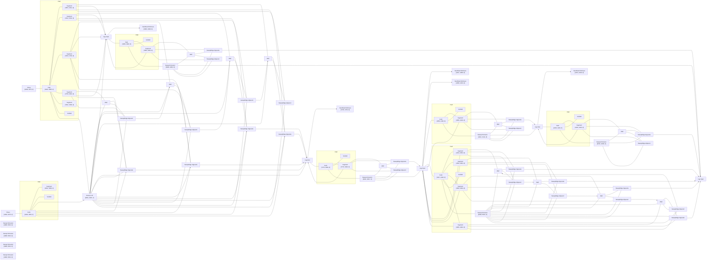

```mermaid
flowchart LR
  subgraph path8 [Path]
    8["Path<br>[2983, 3065, 0]"]
    15["Segment<br>[2081, 2241, 0]"]
    16["Segment<br>[2352, 2533, 0]"]
    17["Segment<br>[2543, 2740, 0]"]
    18["Segment<br>[2750, 2943, 0]"]
    19["Segment<br>[3392, 3399, 0]"]
    30[Solid2d]
  end
  subgraph path9 [Path]
    9["Path<br>[2983, 3065, 0]"]
    20["Segment<br>[3602, 3609, 0]"]
    35[Solid2d]
  end
  subgraph path10 [Path]
    10["Path<br>[3770, 3826, 0]"]
    21["Segment<br>[3770, 3826, 0]"]
    31[Solid2d]
  end
  subgraph path11 [Path]
    11["Path<br>[3906, 3962, 0]"]
    22["Segment<br>[3906, 3962, 0]"]
    32[Solid2d]
  end
  subgraph path12 [Path]
    12["Path<br>[4056, 4106, 0]"]
    23["Segment<br>[4056, 4106, 0]"]
    33[Solid2d]
  end
  subgraph path13 [Path]
    13["Path<br>[4196, 4246, 0]"]
    24["Segment<br>[4196, 4246, 0]"]
    29[Solid2d]
  end
  subgraph path14 [Path]
    14["Path<br>[4347, 4428, 0]"]
    25["Segment<br>[4434, 4553, 0]"]
    26["Segment<br>[4559, 4663, 0]"]
    27["Segment<br>[4669, 4829, 0]"]
    28["Segment<br>[4835, 4842, 0]"]
    34[Solid2d]
  end
  1["Plane<br>[2958, 2975, 0]"]
  2["Plane<br>[2958, 2975, 0]"]
  3["StartSketchOnFace<br>[4017, 4050, 0]"]
  4["StartSketchOnFace<br>[4154, 4190, 0]"]
  5["StartSketchOnFace<br>[3735, 3764, 0]"]
  6["StartSketchOnFace<br>[3869, 3900, 0]"]
  7["StartSketchOnFace<br>[4300, 4333, 0]"]
  36["Sweep Loft<br>[3661, 3687, 0]"]
  37["Sweep Extrusion<br>[3832, 3867, 0]"]
  38["Sweep Extrusion<br>[3968, 4003, 0]"]
  39["Sweep Extrusion<br>[4112, 4141, 0]"]
  40["Sweep Extrusion<br>[4252, 4286, 0]"]
  41["Sweep Extrusion<br>[4988, 5023, 0]"]
  42["Sweep Extrusion<br>[4988, 5023, 0]"]
  43["Sweep Extrusion<br>[4988, 5023, 0]"]
  44["Sweep Extrusion<br>[4988, 5023, 0]"]
  45["Sweep Extrusion<br>[4988, 5023, 0]"]
  46[Wall]
  47[Wall]
  48[Wall]
  49[Wall]
  50[Wall]
  51[Wall]
  52[Wall]
  53[Wall]
  54[Wall]
  55[Wall]
  56[Wall]
  57[Wall]
  58["Cap Start"]
  59["Cap Start"]
  60["Cap Start"]
  61["Cap End"]
  62["Cap End"]
  63["SweepEdge Opposite"]
  64["SweepEdge Opposite"]
  65["SweepEdge Opposite"]
  66["SweepEdge Opposite"]
  67["SweepEdge Opposite"]
  68["SweepEdge Opposite"]
  69["SweepEdge Opposite"]
  70["SweepEdge Opposite"]
  71["SweepEdge Opposite"]
  72["SweepEdge Opposite"]
  73["SweepEdge Opposite"]
  74["SweepEdge Opposite"]
  75["SweepEdge Adjacent"]
  76["SweepEdge Adjacent"]
  77["SweepEdge Adjacent"]
  78["SweepEdge Adjacent"]
  79["SweepEdge Adjacent"]
  80["SweepEdge Adjacent"]
  81["SweepEdge Adjacent"]
  82["SweepEdge Adjacent"]
  83["SweepEdge Adjacent"]
  84["SweepEdge Adjacent"]
  85["SweepEdge Adjacent"]
  86["SweepEdge Adjacent"]
  1 --- 9
  2 --- 8
  59 x--> 3
  62 x--> 4
  61 x--> 5
  58 x--> 6
  59 x--> 7
  8 --- 15
  8 --- 16
  8 --- 17
  8 --- 18
  8 --- 19
  8 --- 30
  8 ---- 36
  9 --- 20
  9 --- 35
  9 x---> 36
  9 x--> 65
  9 x--> 66
  9 x--> 67
  9 x--> 68
  10 --- 21
  10 --- 31
  10 ---- 37
  61 --- 10
  11 --- 22
  11 --- 32
  11 ---- 38
  58 --- 11
  12 --- 23
  12 --- 33
  12 ---- 39
  59 --- 12
  13 --- 24
  13 --- 29
  13 ---- 40
  62 --- 13
  14 --- 25
  14 --- 26
  14 --- 27
  14 --- 28
  14 --- 34
  14 ---- 45
  59 --- 14
  15 --- 51
  15 x--> 58
  15 --- 68
  15 --- 80
  16 --- 49
  16 x--> 58
  16 --- 67
  16 --- 79
  17 --- 48
  17 x--> 58
  17 --- 66
  17 --- 77
  18 --- 50
  18 x--> 58
  18 --- 65
  18 --- 78
  21 --- 47
  21 x--> 61
  21 --- 64
  21 --- 76
  22 --- 52
  22 x--> 58
  22 --- 69
  22 --- 81
  23 --- 57
  23 x--> 59
  23 --- 74
  23 --- 86
  24 --- 46
  24 x--> 62
  24 --- 63
  24 --- 75
  25 --- 56
  25 x--> 59
  25 --- 70
  25 --- 84
  26 --- 54
  26 x--> 59
  26 --- 71
  26 --- 83
  27 --- 55
  27 x--> 59
  27 --- 72
  27 --- 82
  28 --- 53
  28 x--> 59
  28 --- 73
  28 --- 85
  36 --- 48
  36 --- 49
  36 --- 50
  36 --- 51
  36 --- 58
  36 --- 61
  36 --- 65
  36 --- 66
  36 --- 67
  36 --- 68
  36 --- 77
  36 --- 78
  36 --- 79
  36 --- 80
  37 --- 47
  37 --- 59
  37 --- 64
  37 --- 76
  38 --- 52
  38 --- 60
  38 --- 69
  38 --- 81
  39 --- 57
  39 --- 62
  39 --- 74
  39 --- 86
  40 --- 46
  40 --- 63
  40 --- 75
  45 --- 53
  45 --- 54
  45 --- 55
  45 --- 56
  45 --- 70
  45 --- 71
  45 --- 72
  45 --- 73
  45 --- 82
  45 --- 83
  45 --- 84
  45 --- 85
  46 --- 63
  46 --- 75
  47 --- 64
  47 --- 76
  48 --- 66
  48 --- 77
  78 <--x 48
  49 --- 67
  77 <--x 49
  49 --- 79
  50 --- 65
  50 --- 78
  51 --- 68
  79 <--x 51
  51 --- 80
  52 --- 69
  52 --- 81
  53 --- 73
  82 <--x 53
  53 --- 85
  54 --- 71
  54 --- 83
  84 <--x 54
  55 --- 72
  55 --- 82
  83 <--x 55
  56 --- 70
  56 --- 84
  85 <--x 56
  57 --- 74
  57 --- 86
  64 <--x 59
  63 <--x 60
  69 <--x 60
  70 <--x 60
  71 <--x 60
  72 <--x 60
  73 <--x 60
  65 <--x 61
  66 <--x 61
  67 <--x 61
  68 <--x 61
  74 <--x 62
```
