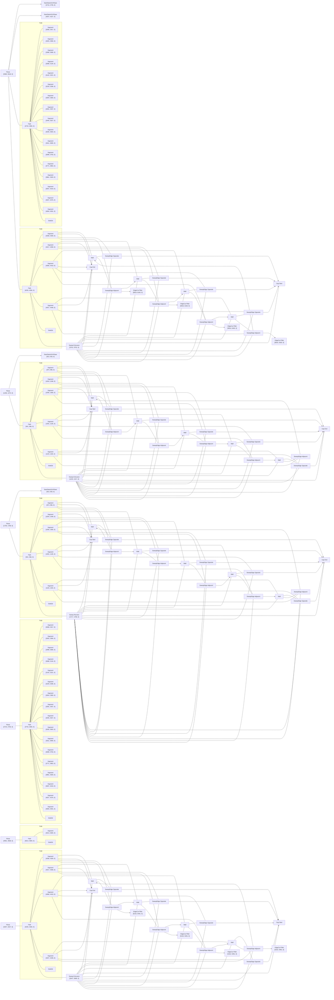

```mermaid
flowchart LR
  subgraph path11 [Path]
    11["Path<br>[941, 966, 0]"]
    18["Segment<br>[974, 996, 0]"]
    21["Segment<br>[1004, 1048, 0]"]
    23["Segment<br>[1056, 1083, 0]"]
    24["Segment<br>[1091, 1135, 0]"]
    26["Segment<br>[1143, 1150, 0]"]
    74[Solid2d]
  end
  subgraph path12 [Path]
    12["Path<br>[941, 966, 0]"]
    19["Segment<br>[974, 996, 0]"]
    20["Segment<br>[1004, 1048, 0]"]
    22["Segment<br>[1056, 1083, 0]"]
    25["Segment<br>[1091, 1135, 0]"]
    27["Segment<br>[1143, 1150, 0]"]
    77[Solid2d]
  end
  subgraph path13 [Path]
    13["Path<br>[2743, 2830, 0]"]
    28["Segment<br>[2838, 2917, 0]"]
    31["Segment<br>[2925, 2990, 0]"]
    33["Segment<br>[2998, 3080, 0]"]
    35["Segment<br>[3088, 3134, 0]"]
    37["Segment<br>[3142, 3221, 0]"]
    38["Segment<br>[3229, 3296, 0]"]
    40["Segment<br>[3304, 3383, 0]"]
    42["Segment<br>[3391, 3437, 0]"]
    45["Segment<br>[3445, 3527, 0]"]
    47["Segment<br>[3535, 3603, 0]"]
    49["Segment<br>[3611, 3690, 0]"]
    50["Segment<br>[3698, 3763, 0]"]
    53["Segment<br>[3771, 3853, 0]"]
    55["Segment<br>[3861, 3929, 0]"]
    57["Segment<br>[3937, 4019, 0]"]
    58["Segment<br>[4027, 4076, 0]"]
    60["Segment<br>[4084, 4091, 0]"]
    71[Solid2d]
  end
  subgraph path14 [Path]
    14["Path<br>[2743, 2830, 0]"]
    29["Segment<br>[2838, 2917, 0]"]
    30["Segment<br>[2925, 2990, 0]"]
    32["Segment<br>[2998, 3080, 0]"]
    34["Segment<br>[3088, 3134, 0]"]
    36["Segment<br>[3142, 3221, 0]"]
    39["Segment<br>[3229, 3296, 0]"]
    41["Segment<br>[3304, 3383, 0]"]
    43["Segment<br>[3391, 3437, 0]"]
    44["Segment<br>[3445, 3527, 0]"]
    46["Segment<br>[3535, 3603, 0]"]
    48["Segment<br>[3611, 3690, 0]"]
    51["Segment<br>[3698, 3763, 0]"]
    52["Segment<br>[3771, 3853, 0]"]
    54["Segment<br>[3861, 3929, 0]"]
    56["Segment<br>[3937, 4019, 0]"]
    59["Segment<br>[4027, 4076, 0]"]
    61["Segment<br>[4084, 4091, 0]"]
    75[Solid2d]
  end
  subgraph path15 [Path]
    15["Path<br>[4235, 4260, 0]"]
    62["Segment<br>[4268, 4309, 0]"]
    65["Segment<br>[4317, 4358, 0]"]
    66["Segment<br>[4366, 4419, 0]"]
    68["Segment<br>[4427, 4448, 0]"]
    72[Solid2d]
  end
  subgraph path16 [Path]
    16["Path<br>[4235, 4260, 0]"]
    63["Segment<br>[4268, 4309, 0]"]
    64["Segment<br>[4317, 4358, 0]"]
    67["Segment<br>[4366, 4419, 0]"]
    69["Segment<br>[4427, 4448, 0]"]
    73[Solid2d]
  end
  subgraph path17 [Path]
    17["Path<br>[4614, 4694, 0]"]
    70["Segment<br>[4614, 4694, 0]"]
    76[Solid2d]
  end
  1["Plane<br>[1236, 1274, 0]"]
  2["Plane<br>[1730, 1768, 0]"]
  3["Plane<br>[2715, 2735, 0]"]
  4["Plane<br>[4207, 4227, 0]"]
  5["Plane<br>[4591, 4608, 0]"]
  6["Plane<br>[5583, 5618, 0]"]
  7["StartSketchOnPlane<br>[2715, 2735, 0]"]
  8["StartSketchOnPlane<br>[913, 933, 0]"]
  9["StartSketchOnPlane<br>[913, 933, 0]"]
  10["StartSketchOnPlane<br>[4207, 4227, 0]"]
  78["Sweep Extrusion<br>[1223, 1317, 0]"]
  79["Sweep Revolve<br>[1717, 1799, 0]"]
  80["Sweep Extrusion<br>[5047, 5089, 0]"]
  81["Sweep Extrusion<br>[5701, 5752, 0]"]
  82[Wall]
  83[Wall]
  84[Wall]
  85[Wall]
  86[Wall]
  87[Wall]
  88[Wall]
  89[Wall]
  90[Wall]
  91[Wall]
  92[Wall]
  93[Wall]
  94[Wall]
  95[Wall]
  96[Wall]
  97[Wall]
  98[Wall]
  99[Wall]
  100["Cap Start"]
  101["Cap Start"]
  102["Cap Start"]
  103["Cap Start"]
  104["Cap End"]
  105["Cap End"]
  106["Cap End"]
  107["Cap End"]
  108["SweepEdge Opposite"]
  109["SweepEdge Opposite"]
  110["SweepEdge Opposite"]
  111["SweepEdge Opposite"]
  112["SweepEdge Opposite"]
  113["SweepEdge Opposite"]
  114["SweepEdge Opposite"]
  115["SweepEdge Opposite"]
  116["SweepEdge Opposite"]
  117["SweepEdge Opposite"]
  118["SweepEdge Opposite"]
  119["SweepEdge Opposite"]
  120["SweepEdge Opposite"]
  121["SweepEdge Opposite"]
  122["SweepEdge Opposite"]
  123["SweepEdge Opposite"]
  124["SweepEdge Opposite"]
  125["SweepEdge Opposite"]
  126["SweepEdge Adjacent"]
  127["SweepEdge Adjacent"]
  128["SweepEdge Adjacent"]
  129["SweepEdge Adjacent"]
  130["SweepEdge Adjacent"]
  131["SweepEdge Adjacent"]
  132["SweepEdge Adjacent"]
  133["SweepEdge Adjacent"]
  134["SweepEdge Adjacent"]
  135["SweepEdge Adjacent"]
  136["SweepEdge Adjacent"]
  137["SweepEdge Adjacent"]
  138["SweepEdge Adjacent"]
  139["SweepEdge Adjacent"]
  140["SweepEdge Adjacent"]
  141["SweepEdge Adjacent"]
  142["SweepEdge Adjacent"]
  143["SweepEdge Adjacent"]
  144["EdgeCut Fillet<br>[5152, 5491, 0]"]
  145["EdgeCut Fillet<br>[5152, 5491, 0]"]
  146["EdgeCut Fillet<br>[5152, 5491, 0]"]
  147["EdgeCut Fillet<br>[5152, 5491, 0]"]
  148["EdgeCut Fillet<br>[5816, 6160, 0]"]
  149["EdgeCut Fillet<br>[5816, 6160, 0]"]
  150["EdgeCut Fillet<br>[5816, 6160, 0]"]
  151["EdgeCut Fillet<br>[5816, 6160, 0]"]
  1 <--x 8
  1 --- 12
  2 <--x 9
  2 --- 11
  3 --- 14
  4 --- 15
  5 --- 17
  6 <--x 7
  6 <--x 10
  6 --- 13
  6 --- 16
  11 --- 18
  11 --- 21
  11 --- 23
  11 --- 24
  11 --- 26
  11 --- 74
  11 ---- 79
  12 --- 19
  12 --- 20
  12 --- 22
  12 --- 25
  12 --- 27
  12 --- 77
  12 ---- 78
  13 --- 28
  13 --- 31
  13 --- 33
  13 --- 35
  13 --- 37
  13 --- 38
  13 --- 40
  13 --- 42
  13 --- 45
  13 --- 47
  13 --- 49
  13 --- 50
  13 --- 53
  13 --- 55
  13 --- 57
  13 --- 58
  13 --- 60
  13 --- 71
  14 --- 29
  14 --- 30
  14 --- 32
  14 --- 34
  14 --- 36
  14 --- 39
  14 --- 41
  14 --- 43
  14 --- 44
  14 --- 46
  14 --- 48
  14 --- 51
  14 --- 52
  14 --- 54
  14 --- 56
  14 --- 59
  14 --- 61
  14 --- 75
  15 --- 62
  15 --- 65
  15 --- 66
  15 --- 68
  15 --- 72
  15 ---- 80
  16 --- 63
  16 --- 64
  16 --- 67
  16 --- 69
  16 --- 73
  16 ---- 81
  17 --- 70
  17 --- 76
  18 --- 82
  18 x--> 103
  18 --- 111
  18 --- 126
  19 --- 97
  19 x--> 102
  19 --- 123
  19 --- 140
  20 --- 96
  20 x--> 102
  20 --- 125
  20 --- 143
  21 --- 86
  21 x--> 103
  21 --- 108
  21 --- 127
  22 --- 95
  22 x--> 102
  22 --- 122
  22 --- 141
  23 --- 84
  23 x--> 103
  23 --- 112
  23 --- 130
  24 --- 83
  24 x--> 103
  24 --- 109
  24 --- 129
  25 --- 98
  25 x--> 102
  25 --- 124
  25 --- 142
  26 --- 85
  26 x--> 103
  26 --- 110
  26 --- 128
  27 --- 99
  27 x--> 102
  27 --- 121
  27 --- 139
  62 --- 93
  62 x--> 105
  62 --- 118
  62 --- 135
  63 --- 90
  63 x--> 104
  63 --- 113
  63 --- 132
  64 --- 87
  64 x--> 104
  64 --- 115
  64 --- 134
  65 --- 92
  65 x--> 105
  65 --- 117
  65 --- 136
  66 --- 91
  66 x--> 105
  66 --- 120
  66 --- 137
  67 --- 88
  67 x--> 104
  67 --- 116
  67 --- 133
  68 --- 94
  68 x--> 105
  68 --- 119
  68 --- 138
  69 --- 89
  69 x--> 104
  69 --- 114
  69 --- 131
  78 --- 95
  78 --- 96
  78 --- 97
  78 --- 98
  78 --- 99
  78 --- 102
  78 --- 106
  78 --- 121
  78 --- 122
  78 --- 123
  78 --- 124
  78 --- 125
  78 --- 139
  78 --- 140
  78 --- 141
  78 --- 142
  78 --- 143
  79 --- 82
  79 --- 83
  79 --- 84
  79 --- 85
  79 --- 86
  79 --- 103
  79 --- 107
  79 --- 108
  79 --- 109
  79 --- 110
  79 --- 111
  79 --- 112
  79 --- 126
  79 --- 127
  79 --- 128
  79 --- 129
  79 --- 130
  80 --- 91
  80 --- 92
  80 --- 93
  80 --- 94
  80 --- 101
  80 --- 105
  80 --- 117
  80 --- 118
  80 --- 119
  80 --- 120
  80 --- 135
  80 --- 136
  80 --- 137
  80 --- 138
  81 --- 87
  81 --- 88
  81 --- 89
  81 --- 90
  81 --- 100
  81 --- 104
  81 --- 113
  81 --- 114
  81 --- 115
  81 --- 116
  81 --- 131
  81 --- 132
  81 --- 133
  81 --- 134
  82 --- 111
  82 --- 126
  128 <--x 82
  83 --- 109
  83 --- 129
  130 <--x 83
  84 --- 112
  127 <--x 84
  84 --- 130
  85 --- 110
  85 --- 128
  129 <--x 85
  86 --- 108
  126 <--x 86
  86 --- 127
  87 --- 115
  132 <--x 87
  87 --- 134
  88 --- 116
  88 --- 133
  134 <--x 88
  89 --- 114
  89 --- 131
  133 <--x 89
  90 --- 113
  131 <--x 90
  90 --- 132
  91 --- 120
  136 <--x 91
  91 --- 137
  92 --- 117
  135 <--x 92
  92 --- 136
  93 --- 118
  93 --- 135
  138 <--x 93
  94 --- 119
  137 <--x 94
  94 --- 138
  95 --- 122
  95 --- 141
  143 <--x 95
  96 --- 125
  140 <--x 96
  96 --- 143
  97 --- 123
  139 <--x 97
  97 --- 140
  98 --- 124
  141 <--x 98
  98 --- 142
  99 --- 121
  99 --- 139
  142 <--x 99
  113 <--x 100
  114 <--x 100
  115 <--x 100
  116 <--x 100
  117 <--x 101
  118 <--x 101
  119 <--x 101
  120 <--x 101
  121 <--x 106
  122 <--x 106
  123 <--x 106
  124 <--x 106
  125 <--x 106
  108 <--x 107
  109 <--x 107
  110 <--x 107
  111 <--x 107
  112 <--x 107
  131 <--x 149
  132 <--x 150
  133 <--x 148
  134 <--x 151
  135 <--x 147
  136 <--x 145
  137 <--x 144
  138 <--x 146
```
