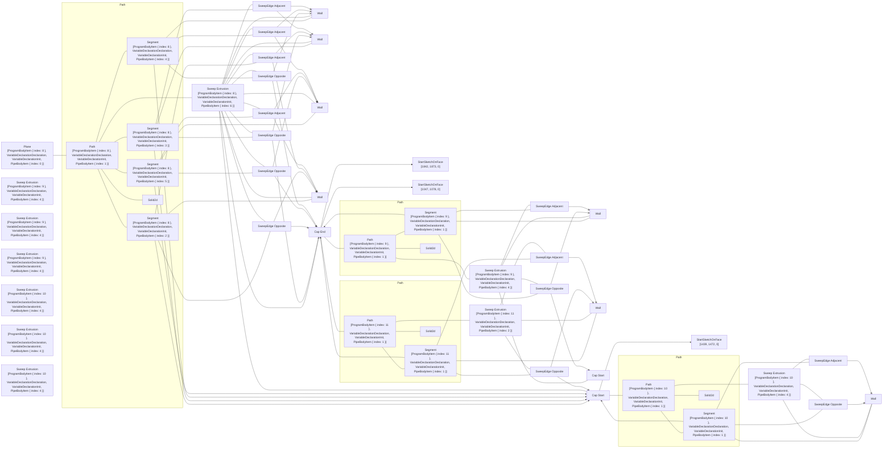

```mermaid
flowchart LR
  subgraph path5 [Path]
    5["Path<br>[ProgramBodyItem { index: 8 }, VariableDeclarationDeclaration, VariableDeclarationInit, PipeBodyItem { index: 1 }]"]
    9["Segment<br>[ProgramBodyItem { index: 8 }, VariableDeclarationDeclaration, VariableDeclarationInit, PipeBodyItem { index: 2 }]"]
    10["Segment<br>[ProgramBodyItem { index: 8 }, VariableDeclarationDeclaration, VariableDeclarationInit, PipeBodyItem { index: 3 }]"]
    11["Segment<br>[ProgramBodyItem { index: 8 }, VariableDeclarationDeclaration, VariableDeclarationInit, PipeBodyItem { index: 4 }]"]
    12["Segment<br>[ProgramBodyItem { index: 8 }, VariableDeclarationDeclaration, VariableDeclarationInit, PipeBodyItem { index: 5 }]"]
    19[Solid2d]
  end
  subgraph path6 [Path]
    6["Path<br>[ProgramBodyItem { index: 9 }, VariableDeclarationDeclaration, VariableDeclarationInit, PipeBodyItem { index: 1 }]"]
    13["Segment<br>[ProgramBodyItem { index: 9 }, VariableDeclarationDeclaration, VariableDeclarationInit, PipeBodyItem { index: 1 }]"]
    18[Solid2d]
  end
  subgraph path7 [Path]
    7["Path<br>[ProgramBodyItem { index: 10 }, VariableDeclarationDeclaration, VariableDeclarationInit, PipeBodyItem { index: 1 }]"]
    14["Segment<br>[ProgramBodyItem { index: 10 }, VariableDeclarationDeclaration, VariableDeclarationInit, PipeBodyItem { index: 1 }]"]
    17[Solid2d]
  end
  subgraph path8 [Path]
    8["Path<br>[ProgramBodyItem { index: 11 }, VariableDeclarationDeclaration, VariableDeclarationInit, PipeBodyItem { index: 1 }]"]
    15["Segment<br>[ProgramBodyItem { index: 11 }, VariableDeclarationDeclaration, VariableDeclarationInit, PipeBodyItem { index: 1 }]"]
    16[Solid2d]
  end
  1["Plane<br>[ProgramBodyItem { index: 8 }, VariableDeclarationDeclaration, VariableDeclarationInit, PipeBodyItem { index: 0 }]"]
  2["StartSketchOnFace<br>[1842, 1873, 0]"]
  3["StartSketchOnFace<br>[1439, 1472, 0]"]
  4["StartSketchOnFace<br>[1047, 1078, 0]"]
  20["Sweep Extrusion<br>[ProgramBodyItem { index: 8 }, VariableDeclarationDeclaration, VariableDeclarationInit, PipeBodyItem { index: 6 }]"]
  21["Sweep Extrusion<br>[ProgramBodyItem { index: 9 }, VariableDeclarationDeclaration, VariableDeclarationInit, PipeBodyItem { index: 4 }]"]
  22["Sweep Extrusion<br>[ProgramBodyItem { index: 9 }, VariableDeclarationDeclaration, VariableDeclarationInit, PipeBodyItem { index: 4 }]"]
  23["Sweep Extrusion<br>[ProgramBodyItem { index: 9 }, VariableDeclarationDeclaration, VariableDeclarationInit, PipeBodyItem { index: 4 }]"]
  24["Sweep Extrusion<br>[ProgramBodyItem { index: 9 }, VariableDeclarationDeclaration, VariableDeclarationInit, PipeBodyItem { index: 4 }]"]
  25["Sweep Extrusion<br>[ProgramBodyItem { index: 10 }, VariableDeclarationDeclaration, VariableDeclarationInit, PipeBodyItem { index: 4 }]"]
  26["Sweep Extrusion<br>[ProgramBodyItem { index: 10 }, VariableDeclarationDeclaration, VariableDeclarationInit, PipeBodyItem { index: 4 }]"]
  27["Sweep Extrusion<br>[ProgramBodyItem { index: 10 }, VariableDeclarationDeclaration, VariableDeclarationInit, PipeBodyItem { index: 4 }]"]
  28["Sweep Extrusion<br>[ProgramBodyItem { index: 10 }, VariableDeclarationDeclaration, VariableDeclarationInit, PipeBodyItem { index: 4 }]"]
  29["Sweep Extrusion<br>[ProgramBodyItem { index: 11 }, VariableDeclarationDeclaration, VariableDeclarationInit, PipeBodyItem { index: 2 }]"]
  30[Wall]
  31[Wall]
  32[Wall]
  33[Wall]
  34[Wall]
  35[Wall]
  36[Wall]
  37["Cap Start"]
  38["Cap Start"]
  39["Cap End"]
  40["SweepEdge Opposite"]
  41["SweepEdge Opposite"]
  42["SweepEdge Opposite"]
  43["SweepEdge Opposite"]
  44["SweepEdge Opposite"]
  45["SweepEdge Opposite"]
  46["SweepEdge Opposite"]
  47["SweepEdge Adjacent"]
  48["SweepEdge Adjacent"]
  49["SweepEdge Adjacent"]
  50["SweepEdge Adjacent"]
  51["SweepEdge Adjacent"]
  52["SweepEdge Adjacent"]
  53["SweepEdge Adjacent"]
  1 --- 5
  39 x--> 2
  38 x--> 3
  39 x--> 4
  5 --- 9
  5 --- 10
  5 --- 11
  5 --- 12
  5 --- 19
  5 ---- 20
  6 --- 13
  6 --- 18
  6 ---- 23
  39 --- 6
  7 --- 14
  7 --- 17
  7 ---- 26
  38 --- 7
  8 --- 15
  8 --- 16
  8 ---- 29
  39 --- 8
  9 --- 34
  9 x--> 38
  9 --- 42
  9 --- 48
  10 --- 32
  10 x--> 38
  10 --- 41
  10 --- 51
  11 --- 31
  11 x--> 38
  11 --- 44
  11 --- 50
  12 --- 33
  12 x--> 38
  12 --- 43
  12 --- 49
  13 --- 35
  13 x--> 39
  13 --- 45
  13 --- 52
  14 --- 30
  14 x--> 38
  14 --- 40
  14 --- 47
  15 --- 36
  15 x--> 39
  15 --- 46
  15 --- 53
  20 --- 31
  20 --- 32
  20 --- 33
  20 --- 34
  20 --- 38
  20 --- 39
  20 --- 41
  20 --- 42
  20 --- 43
  20 --- 44
  20 --- 48
  20 --- 49
  20 --- 50
  20 --- 51
  23 --- 35
  23 --- 37
  23 --- 45
  23 --- 52
  26 --- 30
  26 --- 40
  26 --- 47
  29 --- 36
  29 --- 46
  29 --- 53
  40 <--x 30
  47 <--x 30
  44 <--x 31
  50 <--x 31
  51 <--x 31
  41 <--x 32
  48 <--x 32
  51 <--x 32
  43 <--x 33
  49 <--x 33
  50 <--x 33
  42 <--x 34
  48 <--x 34
  49 <--x 34
  45 <--x 35
  52 <--x 35
  46 <--x 36
  53 <--x 36
  45 <--x 37
  46 <--x 38
  41 <--x 39
  42 <--x 39
  43 <--x 39
  44 <--x 39
```
