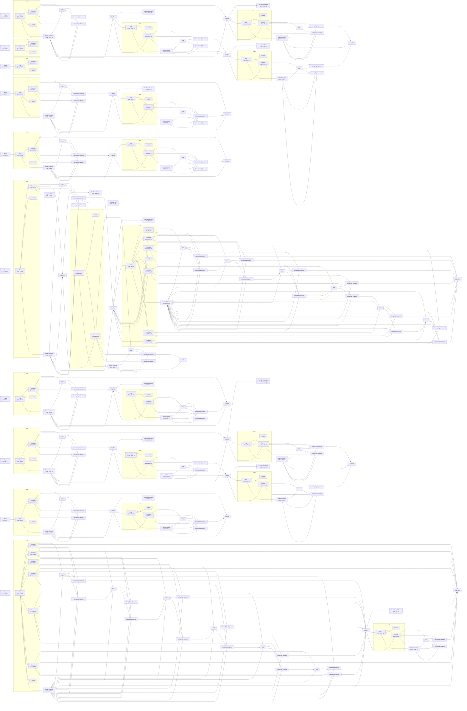

```mermaid
flowchart LR
  subgraph path23 [Path]
    23["Path<br>[440, 502, 2]"]
    46["Segment<br>[440, 502, 2]"]
    93[Solid2d]
  end
  subgraph path24 [Path]
    24["Path<br>[640, 700, 2]"]
    47["Segment<br>[640, 700, 2]"]
    98[Solid2d]
  end
  subgraph path25 [Path]
    25["Path<br>[613, 706, 3]"]
    48["Segment<br>[613, 706, 3]"]
    90[Solid2d]
  end
  subgraph path26 [Path]
    26["Path<br>[613, 706, 3]"]
    49["Segment<br>[613, 706, 3]"]
    95[Solid2d]
  end
  subgraph path27 [Path]
    27["Path<br>[935, 990, 3]"]
    50["Segment<br>[935, 990, 3]"]
    84[Solid2d]
  end
  subgraph path28 [Path]
    28["Path<br>[935, 990, 3]"]
    51["Segment<br>[935, 990, 3]"]
    86[Solid2d]
  end
  subgraph path29 [Path]
    29["Path<br>[1220, 1279, 3]"]
    53["Segment<br>[1220, 1279, 3]"]
    80[Solid2d]
  end
  subgraph path30 [Path]
    30["Path<br>[1220, 1279, 3]"]
    52["Segment<br>[1220, 1279, 3]"]
    97[Solid2d]
  end
  subgraph path31 [Path]
    31["Path<br>[1386, 1446, 3]"]
    54["Segment<br>[1386, 1446, 3]"]
    88[Solid2d]
  end
  subgraph path32 [Path]
    32["Path<br>[1386, 1446, 3]"]
    55["Segment<br>[1386, 1446, 3]"]
    99[Solid2d]
  end
  subgraph path33 [Path]
    33["Path<br>[1608, 1661, 3]"]
    56["Segment<br>[1608, 1661, 3]"]
    83[Solid2d]
  end
  subgraph path34 [Path]
    34["Path<br>[1608, 1661, 3]"]
    57["Segment<br>[1608, 1661, 3]"]
    92[Solid2d]
  end
  subgraph path35 [Path]
    35["Path<br>[429, 481, 4]"]
    58["Segment<br>[429, 481, 4]"]
    82[Solid2d]
  end
  subgraph path36 [Path]
    36["Path<br>[619, 671, 4]"]
    59["Segment<br>[619, 671, 4]"]
    89[Solid2d]
  end
  subgraph path37 [Path]
    37["Path<br>[457, 527, 5]"]
    60["Segment<br>[457, 527, 5]"]
    81[Solid2d]
  end
  subgraph path38 [Path]
    38["Path<br>[796, 883, 5]"]
    61["Segment<br>[891, 942, 5]"]
    62["Segment<br>[950, 1001, 5]"]
    63["Segment<br>[1009, 1060, 5]"]
    64["Segment<br>[1068, 1118, 5]"]
    65["Segment<br>[1126, 1176, 5]"]
    66["Segment<br>[1184, 1191, 5]"]
    100[Solid2d]
  end
  subgraph path39 [Path]
    39["Path<br>[1330, 1399, 5]"]
    67["Segment<br>[1330, 1399, 5]"]
    101[Solid2d]
  end
  subgraph path40 [Path]
    40["Path<br>[443, 533, 6]"]
    68["Segment<br>[541, 591, 6]"]
    69["Segment<br>[599, 649, 6]"]
    70["Segment<br>[657, 707, 6]"]
    71["Segment<br>[715, 764, 6]"]
    72["Segment<br>[772, 821, 6]"]
    73["Segment<br>[829, 836, 6]"]
    79[Solid2d]
  end
  subgraph path41 [Path]
    41["Path<br>[985, 1037, 6]"]
    74["Segment<br>[985, 1037, 6]"]
    87[Solid2d]
  end
  subgraph path42 [Path]
    42["Path<br>[343, 401, 7]"]
    76["Segment<br>[343, 401, 7]"]
    85[Solid2d]
  end
  subgraph path43 [Path]
    43["Path<br>[343, 401, 7]"]
    75["Segment<br>[343, 401, 7]"]
    94[Solid2d]
  end
  subgraph path44 [Path]
    44["Path<br>[545, 600, 7]"]
    77["Segment<br>[545, 600, 7]"]
    91[Solid2d]
  end
  subgraph path45 [Path]
    45["Path<br>[545, 600, 7]"]
    78["Segment<br>[545, 600, 7]"]
    96[Solid2d]
  end
  1["Plane<br>[417, 434, 2]"]
  2["Plane<br>[588, 605, 3]"]
  3["Plane<br>[588, 605, 3]"]
  4["Plane<br>[910, 927, 3]"]
  5["Plane<br>[910, 927, 3]"]
  6["Plane<br>[404, 421, 4]"]
  7["Plane<br>[432, 449, 5]"]
  8["Plane<br>[418, 435, 6]"]
  9["Plane<br>[318, 335, 7]"]
  10["Plane<br>[318, 335, 7]"]
  11["StartSketchOnFace<br>[751, 788, 5]"]
  12["StartSketchOnFace<br>[1173, 1212, 3]"]
  13["StartSketchOnFace<br>[1341, 1378, 3]"]
  14["StartSketchOnFace<br>[502, 537, 7]"]
  15["StartSketchOnFace<br>[1287, 1322, 5]"]
  16["StartSketchOnFace<br>[940, 977, 6]"]
  17["StartSketchOnFace<br>[574, 611, 4]"]
  18["StartSketchOnFace<br>[1562, 1600, 3]"]
  19["StartSketchOnFace<br>[1173, 1212, 3]"]
  20["StartSketchOnFace<br>[1562, 1600, 3]"]
  21["StartSketchOnFace<br>[1341, 1378, 3]"]
  22["StartSketchOnFace<br>[502, 537, 7]"]
  102["Sweep Extrusion<br>[508, 544, 2]"]
  103["Sweep Extrusion<br>[706, 743, 2]"]
  104["Sweep Extrusion<br>[1038, 1078, 3]"]
  105["Sweep Extrusion<br>[1038, 1078, 3]"]
  106["Sweep Extrusion<br>[1287, 1324, 3]"]
  107["Sweep Extrusion<br>[1287, 1324, 3]"]
  108["Sweep Extrusion<br>[1454, 1492, 3]"]
  109["Sweep Extrusion<br>[1454, 1492, 3]"]
  110["Sweep Extrusion<br>[1669, 1711, 3]"]
  111["Sweep Extrusion<br>[1669, 1711, 3]"]
  112["Sweep Extrusion<br>[489, 522, 4]"]
  113["Sweep Extrusion<br>[679, 716, 4]"]
  114["Sweep Extrusion<br>[535, 568, 5]"]
  115["Sweep Extrusion<br>[1199, 1239, 5]"]
  116["Sweep Extrusion<br>[1407, 1435, 5]"]
  117["Sweep Extrusion<br>[844, 877, 6]"]
  118["Sweep Extrusion<br>[1045, 1082, 6]"]
  119["Sweep Extrusion<br>[409, 440, 7]"]
  120["Sweep Extrusion<br>[409, 440, 7]"]
  121["Sweep Extrusion<br>[608, 640, 7]"]
  122["Sweep Extrusion<br>[608, 640, 7]"]
  123[Wall]
  124[Wall]
  125[Wall]
  126[Wall]
  127[Wall]
  128[Wall]
  129[Wall]
  130[Wall]
  131[Wall]
  132[Wall]
  133[Wall]
  134[Wall]
  135[Wall]
  136[Wall]
  137[Wall]
  138[Wall]
  139[Wall]
  140[Wall]
  141[Wall]
  142[Wall]
  143[Wall]
  144[Wall]
  145[Wall]
  146[Wall]
  147[Wall]
  148[Wall]
  149[Wall]
  150[Wall]
  151[Wall]
  152[Wall]
  153[Wall]
  154["Cap Start"]
  155["Cap Start"]
  156["Cap Start"]
  157["Cap Start"]
  158["Cap Start"]
  159["Cap Start"]
  160["Cap Start"]
  161["Cap Start"]
  162["Cap Start"]
  163["Cap End"]
  164["Cap End"]
  165["Cap End"]
  166["Cap End"]
  167["Cap End"]
  168["Cap End"]
  169["Cap End"]
  170["Cap End"]
  171["Cap End"]
  172["Cap End"]
  173["Cap End"]
  174["Cap End"]
  175["Cap End"]
  176["SweepEdge Opposite"]
  177["SweepEdge Opposite"]
  178["SweepEdge Opposite"]
  179["SweepEdge Opposite"]
  180["SweepEdge Opposite"]
  181["SweepEdge Opposite"]
  182["SweepEdge Opposite"]
  183["SweepEdge Opposite"]
  184["SweepEdge Opposite"]
  185["SweepEdge Opposite"]
  186["SweepEdge Opposite"]
  187["SweepEdge Opposite"]
  188["SweepEdge Opposite"]
  189["SweepEdge Opposite"]
  190["SweepEdge Opposite"]
  191["SweepEdge Opposite"]
  192["SweepEdge Opposite"]
  193["SweepEdge Opposite"]
  194["SweepEdge Opposite"]
  195["SweepEdge Opposite"]
  196["SweepEdge Opposite"]
  197["SweepEdge Opposite"]
  198["SweepEdge Opposite"]
  199["SweepEdge Opposite"]
  200["SweepEdge Opposite"]
  201["SweepEdge Opposite"]
  202["SweepEdge Opposite"]
  203["SweepEdge Opposite"]
  204["SweepEdge Opposite"]
  205["SweepEdge Opposite"]
  206["SweepEdge Opposite"]
  207["SweepEdge Adjacent"]
  208["SweepEdge Adjacent"]
  209["SweepEdge Adjacent"]
  210["SweepEdge Adjacent"]
  211["SweepEdge Adjacent"]
  212["SweepEdge Adjacent"]
  213["SweepEdge Adjacent"]
  214["SweepEdge Adjacent"]
  215["SweepEdge Adjacent"]
  216["SweepEdge Adjacent"]
  217["SweepEdge Adjacent"]
  218["SweepEdge Adjacent"]
  219["SweepEdge Adjacent"]
  220["SweepEdge Adjacent"]
  221["SweepEdge Adjacent"]
  222["SweepEdge Adjacent"]
  223["SweepEdge Adjacent"]
  224["SweepEdge Adjacent"]
  225["SweepEdge Adjacent"]
  226["SweepEdge Adjacent"]
  227["SweepEdge Adjacent"]
  228["SweepEdge Adjacent"]
  229["SweepEdge Adjacent"]
  230["SweepEdge Adjacent"]
  231["SweepEdge Adjacent"]
  232["SweepEdge Adjacent"]
  233["SweepEdge Adjacent"]
  234["SweepEdge Adjacent"]
  235["SweepEdge Adjacent"]
  236["SweepEdge Adjacent"]
  237["SweepEdge Adjacent"]
  238["EdgeCut Fillet<br>[576, 642, 5]"]
  239["EdgeCut Fillet<br>[576, 642, 5]"]
  1 --- 23
  2 --- 26
  3 --- 25
  4 --- 27
  5 --- 28
  6 --- 35
  7 --- 37
  8 --- 40
  9 --- 42
  10 --- 43
  161 x--> 11
  154 x--> 12
  164 x--> 13
  167 x--> 14
  173 x--> 15
  170 x--> 16
  172 x--> 17
  169 x--> 18
  159 x--> 19
  165 x--> 20
  171 x--> 21
  175 x--> 22
  23 --- 46
  23 --- 93
  23 ---- 102
  24 --- 47
  24 --- 98
  24 ---- 103
  166 --- 24
  25 --- 48
  25 --- 90
  26 --- 49
  26 --- 95
  27 --- 50
  27 --- 84
  27 ---- 105
  28 --- 51
  28 --- 86
  28 ---- 104
  29 --- 53
  29 --- 80
  29 ---- 106
  154 --- 29
  30 --- 52
  30 --- 97
  30 ---- 107
  159 --- 30
  31 --- 54
  31 --- 88
  31 ---- 108
  164 --- 31
  32 --- 55
  32 --- 99
  32 ---- 109
  171 --- 32
  33 --- 56
  33 --- 83
  33 ---- 110
  169 --- 33
  34 --- 57
  34 --- 92
  34 ---- 111
  165 --- 34
  35 --- 58
  35 --- 82
  35 ---- 112
  36 --- 59
  36 --- 89
  36 ---- 113
  172 --- 36
  37 --- 60
  37 --- 81
  37 ---- 114
  38 --- 61
  38 --- 62
  38 --- 63
  38 --- 64
  38 --- 65
  38 --- 66
  38 --- 100
  38 ---- 115
  161 --- 38
  39 --- 67
  39 --- 101
  39 ---- 116
  173 --- 39
  40 --- 68
  40 --- 69
  40 --- 70
  40 --- 71
  40 --- 72
  40 --- 73
  40 --- 79
  40 ---- 117
  41 --- 74
  41 --- 87
  41 ---- 118
  170 --- 41
  42 --- 76
  42 --- 85
  42 ---- 120
  43 --- 75
  43 --- 94
  43 ---- 119
  44 --- 77
  44 --- 91
  44 ---- 121
  167 --- 44
  45 --- 78
  45 --- 96
  45 ---- 122
  175 --- 45
  46 --- 140
  46 x--> 155
  46 --- 193
  46 --- 224
  47 --- 135
  47 x--> 166
  47 --- 188
  47 --- 219
  50 --- 134
  50 x--> 154
  50 --- 187
  50 --- 218
  51 --- 131
  51 x--> 159
  51 --- 184
  51 --- 215
  52 --- 130
  52 x--> 159
  52 --- 183
  52 --- 214
  53 --- 123
  53 x--> 154
  53 --- 176
  53 --- 207
  54 --- 139
  54 x--> 164
  54 --- 192
  54 --- 223
  55 --- 142
  55 x--> 171
  55 --- 195
  55 --- 226
  56 --- 138
  56 x--> 169
  56 --- 191
  56 --- 222
  57 --- 141
  57 x--> 165
  57 --- 194
  57 --- 225
  58 --- 145
  58 x--> 160
  58 --- 198
  58 --- 229
  59 --- 144
  59 x--> 172
  59 --- 197
  59 --- 228
  60 --- 153
  60 x--> 173
  60 --- 206
  60 --- 237
  60 --- 239
  61 --- 125
  61 x--> 161
  61 --- 181
  61 --- 210
  62 --- 124
  62 x--> 161
  62 --- 178
  62 --- 212
  63 --- 129
  63 x--> 161
  63 --- 182
  63 --- 213
  64 --- 127
  64 x--> 161
  64 --- 180
  64 --- 209
  65 --- 128
  65 x--> 161
  65 --- 179
  65 --- 211
  66 --- 126
  66 x--> 161
  66 --- 177
  66 --- 208
  67 --- 132
  67 x--> 173
  67 --- 185
  67 --- 216
  68 --- 151
  68 x--> 157
  68 --- 200
  68 --- 230
  69 --- 149
  69 x--> 157
  69 --- 203
  69 --- 231
  70 --- 146
  70 x--> 157
  70 --- 199
  70 --- 233
  71 --- 147
  71 x--> 157
  71 --- 202
  71 --- 234
  72 --- 148
  72 x--> 157
  72 --- 201
  72 --- 235
  73 --- 150
  73 x--> 157
  73 --- 204
  73 --- 232
  74 --- 136
  74 x--> 170
  74 --- 189
  74 --- 220
  75 --- 137
  75 x--> 156
  75 --- 190
  75 --- 221
  76 --- 152
  76 x--> 162
  76 --- 205
  76 --- 236
  77 --- 133
  77 x--> 167
  77 --- 186
  77 --- 217
  78 --- 143
  78 x--> 175
  78 --- 196
  78 --- 227
  102 --- 140
  102 --- 155
  102 --- 166
  102 --- 193
  102 --- 224
  103 --- 135
  103 --- 188
  103 --- 219
  104 --- 131
  104 --- 159
  104 --- 171
  104 --- 184
  104 --- 215
  105 --- 134
  105 --- 154
  105 --- 164
  105 --- 187
  105 --- 218
  106 --- 123
  106 --- 163
  106 --- 176
  106 --- 207
  107 --- 130
  107 --- 168
  107 --- 183
  107 --- 214
  108 --- 139
  108 --- 169
  108 --- 192
  108 --- 223
  109 --- 142
  109 --- 165
  109 --- 195
  109 --- 226
  110 --- 138
  110 --- 191
  110 --- 222
  111 --- 141
  111 --- 194
  111 --- 225
  112 --- 145
  112 --- 160
  112 --- 172
  112 --- 198
  112 --- 229
  113 --- 144
  113 --- 197
  113 --- 228
  114 --- 153
  114 --- 161
  114 --- 173
  114 --- 206
  114 --- 237
  115 --- 124
  115 --- 125
  115 --- 126
  115 --- 127
  115 --- 128
  115 --- 129
  115 --- 158
  115 --- 177
  115 --- 178
  115 --- 179
  115 --- 180
  115 --- 181
  115 --- 182
  115 --- 208
  115 --- 209
  115 --- 210
  115 --- 211
  115 --- 212
  115 --- 213
  116 --- 132
  116 --- 174
  116 --- 185
  116 --- 216
  117 --- 146
  117 --- 147
  117 --- 148
  117 --- 149
  117 --- 150
  117 --- 151
  117 --- 157
  117 --- 170
  117 --- 199
  117 --- 200
  117 --- 201
  117 --- 202
  117 --- 203
  117 --- 204
  117 --- 230
  117 --- 231
  117 --- 232
  117 --- 233
  117 --- 234
  117 --- 235
  118 --- 136
  118 --- 189
  118 --- 220
  119 --- 137
  119 --- 156
  119 --- 167
  119 --- 190
  119 --- 221
  120 --- 152
  120 --- 162
  120 --- 175
  120 --- 205
  120 --- 236
  121 --- 133
  121 --- 186
  121 --- 217
  122 --- 143
  122 --- 196
  122 --- 227
  123 --- 176
  123 --- 207
  124 --- 178
  210 <--x 124
  124 --- 212
  125 --- 181
  208 <--x 125
  125 --- 210
  126 --- 177
  126 --- 208
  211 <--x 126
  127 --- 180
  127 --- 209
  213 <--x 127
  128 --- 179
  209 <--x 128
  128 --- 211
  129 --- 182
  212 <--x 129
  129 --- 213
  130 --- 183
  130 --- 214
  131 --- 184
  131 --- 215
  132 --- 185
  132 --- 216
  133 --- 186
  133 --- 217
  134 --- 187
  134 --- 218
  135 --- 188
  135 --- 219
  136 --- 189
  136 --- 220
  137 --- 190
  137 --- 221
  138 --- 191
  138 --- 222
  139 --- 192
  139 --- 223
  140 --- 193
  140 --- 224
  141 --- 194
  141 --- 225
  142 --- 195
  142 --- 226
  143 --- 196
  143 --- 227
  144 --- 197
  144 --- 228
  145 --- 198
  145 --- 229
  146 --- 199
  231 <--x 146
  146 --- 233
  147 --- 202
  233 <--x 147
  147 --- 234
  148 --- 201
  234 <--x 148
  148 --- 235
  149 --- 203
  230 <--x 149
  149 --- 231
  150 --- 204
  150 --- 232
  235 <--x 150
  151 --- 200
  151 --- 230
  232 <--x 151
  152 --- 205
  152 --- 236
  153 --- 206
  153 --- 237
  188 <--x 155
  186 <--x 156
  189 <--x 157
  177 <--x 158
  178 <--x 158
  179 <--x 158
  180 <--x 158
  181 <--x 158
  182 <--x 158
  197 <--x 160
  206 <--x 161
  196 <--x 162
  176 <--x 163
  191 <--x 163
  187 <--x 164
  195 <--x 165
  193 <--x 166
  190 <--x 167
  183 <--x 168
  194 <--x 168
  192 <--x 169
  199 <--x 170
  200 <--x 170
  201 <--x 170
  202 <--x 170
  203 <--x 170
  204 <--x 170
  184 <--x 171
  198 <--x 172
  185 <--x 174
  205 <--x 175
  206 <--x 238
```
