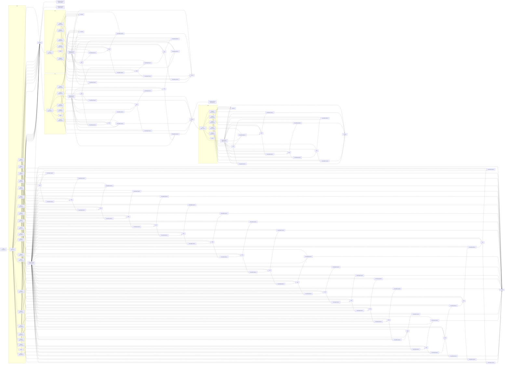

```mermaid
flowchart LR
  subgraph path5 [Path]
    5["Path<br>[558, 601, 0]"]
    9["Segment<br>[607, 660, 0]"]
    10["Segment<br>[666, 777, 0]"]
    11["Segment<br>[783, 836, 0]"]
    12["Segment<br>[842, 889, 0]"]
    13["Segment<br>[895, 991, 0]"]
    14["Segment<br>[997, 1068, 0]"]
    15["Segment<br>[1074, 1125, 0]"]
    16["Segment<br>[1131, 1184, 0]"]
    17["Segment<br>[1190, 1259, 0]"]
    18["Segment<br>[1265, 1301, 0]"]
    19["Segment<br>[1307, 1337, 0]"]
    20["Segment<br>[1343, 1373, 0]"]
    21["Segment<br>[1379, 1409, 0]"]
    22["Segment<br>[1415, 1445, 0]"]
    23["Segment<br>[1451, 1480, 0]"]
    24["Segment<br>[1486, 1516, 0]"]
    25["Segment<br>[1522, 1551, 0]"]
    26["Segment<br>[1557, 1586, 0]"]
    27["Segment<br>[1592, 1655, 0]"]
    28["Segment<br>[1661, 1717, 0]"]
    29["Segment<br>[1723, 1730, 0]"]
    48[Solid2d]
  end
  subgraph path6 [Path]
    6["Path<br>[1890, 1934, 0]"]
    30["Segment<br>[1940, 2020, 0]"]
    31["Segment<br>[2026, 2136, 0]"]
    32["Segment<br>[2142, 2259, 0]"]
    33["Segment<br>[2265, 2321, 0]"]
    34["Segment<br>[2327, 2334, 0]"]
    45[Solid2d]
  end
  subgraph path7 [Path]
    7["Path<br>[2495, 2540, 0]"]
    35["Segment<br>[2546, 2624, 0]"]
    36["Segment<br>[2630, 2740, 0]"]
    37["Segment<br>[2746, 2863, 0]"]
    38["Segment<br>[2869, 2925, 0]"]
    39["Segment<br>[2931, 2938, 0]"]
    47[Solid2d]
  end
  subgraph path8 [Path]
    8["Path<br>[3097, 3142, 0]"]
    40["Segment<br>[3148, 3233, 0]"]
    41["Segment<br>[3239, 3349, 0]"]
    42["Segment<br>[3355, 3472, 0]"]
    43["Segment<br>[3478, 3534, 0]"]
    44["Segment<br>[3540, 3547, 0]"]
    46[Solid2d]
  end
  1["Plane<br>[535, 552, 0]"]
  2["StartSketchOnFace<br>[2450, 2489, 0]"]
  3["StartSketchOnFace<br>[1845, 1884, 0]"]
  4["StartSketchOnFace<br>[3054, 3091, 0]"]
  49["Sweep Extrusion<br>[1773, 1803, 0]"]
  50["Sweep Extrusion<br>[2378, 2409, 0]"]
  51["Sweep Extrusion<br>[2981, 3012, 0]"]
  52["Sweep Extrusion<br>[3591, 3621, 0]"]
  53[Wall]
  54[Wall]
  55[Wall]
  56[Wall]
  57[Wall]
  58[Wall]
  59[Wall]
  60[Wall]
  61[Wall]
  62[Wall]
  63[Wall]
  64[Wall]
  65[Wall]
  66[Wall]
  67[Wall]
  68[Wall]
  69[Wall]
  70[Wall]
  71[Wall]
  72[Wall]
  73[Wall]
  74[Wall]
  75[Wall]
  76[Wall]
  77[Wall]
  78[Wall]
  79[Wall]
  80[Wall]
  81[Wall]
  82[Wall]
  83[Wall]
  84["Cap Start"]
  85["Cap Start"]
  86["Cap Start"]
  87["Cap Start"]
  88["Cap End"]
  89["Cap End"]
  90["Cap End"]
  91["Cap End"]
  92["SweepEdge Opposite"]
  93["SweepEdge Opposite"]
  94["SweepEdge Opposite"]
  95["SweepEdge Opposite"]
  96["SweepEdge Opposite"]
  97["SweepEdge Opposite"]
  98["SweepEdge Opposite"]
  99["SweepEdge Opposite"]
  100["SweepEdge Opposite"]
  101["SweepEdge Opposite"]
  102["SweepEdge Opposite"]
  103["SweepEdge Opposite"]
  104["SweepEdge Opposite"]
  105["SweepEdge Opposite"]
  106["SweepEdge Opposite"]
  107["SweepEdge Opposite"]
  108["SweepEdge Opposite"]
  109["SweepEdge Opposite"]
  110["SweepEdge Opposite"]
  111["SweepEdge Opposite"]
  112["SweepEdge Opposite"]
  113["SweepEdge Opposite"]
  114["SweepEdge Opposite"]
  115["SweepEdge Opposite"]
  116["SweepEdge Opposite"]
  117["SweepEdge Opposite"]
  118["SweepEdge Opposite"]
  119["SweepEdge Opposite"]
  120["SweepEdge Opposite"]
  121["SweepEdge Opposite"]
  122["SweepEdge Opposite"]
  123["SweepEdge Adjacent"]
  124["SweepEdge Adjacent"]
  125["SweepEdge Adjacent"]
  126["SweepEdge Adjacent"]
  127["SweepEdge Adjacent"]
  128["SweepEdge Adjacent"]
  129["SweepEdge Adjacent"]
  130["SweepEdge Adjacent"]
  131["SweepEdge Adjacent"]
  132["SweepEdge Adjacent"]
  133["SweepEdge Adjacent"]
  134["SweepEdge Adjacent"]
  135["SweepEdge Adjacent"]
  136["SweepEdge Adjacent"]
  137["SweepEdge Adjacent"]
  138["SweepEdge Adjacent"]
  139["SweepEdge Adjacent"]
  140["SweepEdge Adjacent"]
  141["SweepEdge Adjacent"]
  142["SweepEdge Adjacent"]
  143["SweepEdge Adjacent"]
  144["SweepEdge Adjacent"]
  145["SweepEdge Adjacent"]
  146["SweepEdge Adjacent"]
  147["SweepEdge Adjacent"]
  148["SweepEdge Adjacent"]
  149["SweepEdge Adjacent"]
  150["SweepEdge Adjacent"]
  151["SweepEdge Adjacent"]
  152["SweepEdge Adjacent"]
  153["SweepEdge Adjacent"]
  1 --- 5
  85 x--> 2
  85 x--> 3
  91 x--> 4
  5 --- 9
  5 --- 10
  5 --- 11
  5 --- 12
  5 --- 13
  5 --- 14
  5 --- 15
  5 --- 16
  5 --- 17
  5 --- 18
  5 --- 19
  5 --- 20
  5 --- 21
  5 --- 22
  5 --- 23
  5 --- 24
  5 --- 25
  5 --- 26
  5 --- 27
  5 --- 28
  5 --- 29
  5 --- 48
  5 ---- 49
  6 --- 30
  6 --- 31
  6 --- 32
  6 --- 33
  6 --- 34
  6 --- 45
  6 ---- 50
  85 --- 6
  7 --- 35
  7 --- 36
  7 --- 37
  7 --- 38
  7 --- 39
  7 --- 47
  7 ---- 51
  85 --- 7
  8 --- 40
  8 --- 41
  8 --- 42
  8 --- 43
  8 --- 44
  8 --- 46
  8 ---- 52
  91 --- 8
  9 --- 75
  9 x--> 85
  9 --- 100
  9 --- 131
  10 --- 69
  10 x--> 85
  10 --- 101
  10 --- 132
  11 --- 68
  11 x--> 85
  11 --- 102
  11 --- 133
  12 --- 71
  12 x--> 85
  12 --- 103
  12 --- 134
  13 --- 66
  13 x--> 85
  13 --- 104
  13 --- 135
  14 --- 65
  14 x--> 85
  14 --- 105
  14 --- 136
  15 --- 74
  15 x--> 85
  15 --- 106
  15 --- 137
  16 --- 78
  16 x--> 85
  16 --- 107
  16 --- 138
  17 --- 77
  17 x--> 85
  17 --- 108
  17 --- 139
  18 --- 64
  18 x--> 85
  18 --- 109
  18 --- 140
  20 --- 79
  20 x--> 85
  20 --- 110
  20 --- 141
  21 --- 72
  21 x--> 85
  21 --- 111
  21 --- 142
  22 --- 67
  22 x--> 85
  22 --- 112
  22 --- 143
  23 --- 62
  23 x--> 85
  23 --- 113
  23 --- 144
  24 --- 73
  24 x--> 85
  24 --- 114
  24 --- 145
  25 --- 63
  25 x--> 85
  25 --- 115
  25 --- 146
  26 --- 76
  26 x--> 85
  26 --- 116
  26 --- 147
  27 --- 61
  27 x--> 85
  27 --- 117
  27 --- 148
  28 --- 70
  28 x--> 85
  28 --- 118
  28 --- 149
  30 --- 57
  30 x--> 87
  30 --- 96
  30 --- 127
  31 --- 59
  31 x--> 87
  31 --- 97
  31 --- 128
  32 --- 60
  32 x--> 87
  32 --- 98
  32 --- 129
  33 --- 58
  33 x--> 87
  33 --- 99
  33 --- 130
  35 --- 55
  35 x--> 84
  35 --- 95
  35 --- 126
  36 --- 56
  36 x--> 84
  36 --- 94
  36 --- 125
  37 --- 53
  37 x--> 84
  37 --- 93
  37 --- 124
  38 --- 54
  38 x--> 84
  38 --- 92
  38 --- 123
  40 --- 81
  40 x--> 86
  40 --- 122
  40 --- 153
  41 --- 80
  41 x--> 86
  41 --- 121
  41 --- 152
  42 --- 83
  42 x--> 86
  42 --- 120
  42 --- 151
  43 --- 82
  43 x--> 86
  43 --- 119
  43 --- 150
  49 --- 61
  49 --- 62
  49 --- 63
  49 --- 64
  49 --- 65
  49 --- 66
  49 --- 67
  49 --- 68
  49 --- 69
  49 --- 70
  49 --- 71
  49 --- 72
  49 --- 73
  49 --- 74
  49 --- 75
  49 --- 76
  49 --- 77
  49 --- 78
  49 --- 79
  49 --- 85
  49 --- 89
  49 --- 100
  49 --- 101
  49 --- 102
  49 --- 103
  49 --- 104
  49 --- 105
  49 --- 106
  49 --- 107
  49 --- 108
  49 --- 109
  49 --- 110
  49 --- 111
  49 --- 112
  49 --- 113
  49 --- 114
  49 --- 115
  49 --- 116
  49 --- 117
  49 --- 118
  49 --- 131
  49 --- 132
  49 --- 133
  49 --- 134
  49 --- 135
  49 --- 136
  49 --- 137
  49 --- 138
  49 --- 139
  49 --- 140
  49 --- 141
  49 --- 142
  49 --- 143
  49 --- 144
  49 --- 145
  49 --- 146
  49 --- 147
  49 --- 148
  49 --- 149
  50 --- 57
  50 --- 58
  50 --- 59
  50 --- 60
  50 --- 87
  50 --- 91
  50 --- 96
  50 --- 97
  50 --- 98
  50 --- 99
  50 --- 127
  50 --- 128
  50 --- 129
  50 --- 130
  51 --- 53
  51 --- 54
  51 --- 55
  51 --- 56
  51 --- 84
  51 --- 88
  51 --- 92
  51 --- 93
  51 --- 94
  51 --- 95
  51 --- 123
  51 --- 124
  51 --- 125
  51 --- 126
  52 --- 80
  52 --- 81
  52 --- 82
  52 --- 83
  52 --- 86
  52 --- 90
  52 --- 119
  52 --- 120
  52 --- 121
  52 --- 122
  52 --- 150
  52 --- 151
  52 --- 152
  52 --- 153
  53 --- 93
  123 <--x 53
  53 --- 124
  54 --- 92
  54 --- 123
  126 <--x 54
  55 --- 95
  125 <--x 55
  55 --- 126
  56 --- 94
  124 <--x 56
  56 --- 125
  57 --- 96
  57 --- 127
  130 <--x 57
  58 --- 99
  129 <--x 58
  58 --- 130
  59 --- 97
  127 <--x 59
  59 --- 128
  60 --- 98
  128 <--x 60
  60 --- 129
  61 --- 117
  147 <--x 61
  61 --- 148
  62 --- 113
  143 <--x 62
  62 --- 144
  63 --- 115
  145 <--x 63
  63 --- 146
  64 --- 109
  139 <--x 64
  64 --- 140
  65 --- 105
  135 <--x 65
  65 --- 136
  66 --- 104
  134 <--x 66
  66 --- 135
  67 --- 112
  142 <--x 67
  67 --- 143
  68 --- 102
  132 <--x 68
  68 --- 133
  69 --- 101
  131 <--x 69
  69 --- 132
  70 --- 118
  148 <--x 70
  70 --- 149
  71 --- 103
  133 <--x 71
  71 --- 134
  72 --- 111
  141 <--x 72
  72 --- 142
  73 --- 114
  144 <--x 73
  73 --- 145
  74 --- 106
  136 <--x 74
  74 --- 137
  75 --- 100
  75 --- 131
  149 <--x 75
  76 --- 116
  146 <--x 76
  76 --- 147
  77 --- 108
  138 <--x 77
  77 --- 139
  78 --- 107
  137 <--x 78
  78 --- 138
  79 --- 110
  140 <--x 79
  79 --- 141
  80 --- 121
  151 <--x 80
  80 --- 152
  81 --- 122
  152 <--x 81
  81 --- 153
  82 --- 119
  82 --- 150
  153 <--x 82
  83 --- 120
  150 <--x 83
  83 --- 151
  92 <--x 88
  93 <--x 88
  94 <--x 88
  95 <--x 88
  100 <--x 89
  101 <--x 89
  102 <--x 89
  103 <--x 89
  104 <--x 89
  105 <--x 89
  106 <--x 89
  107 <--x 89
  108 <--x 89
  109 <--x 89
  110 <--x 89
  111 <--x 89
  112 <--x 89
  113 <--x 89
  114 <--x 89
  115 <--x 89
  116 <--x 89
  117 <--x 89
  118 <--x 89
  119 <--x 90
  120 <--x 90
  121 <--x 90
  122 <--x 90
  96 <--x 91
  97 <--x 91
  98 <--x 91
  99 <--x 91
```
