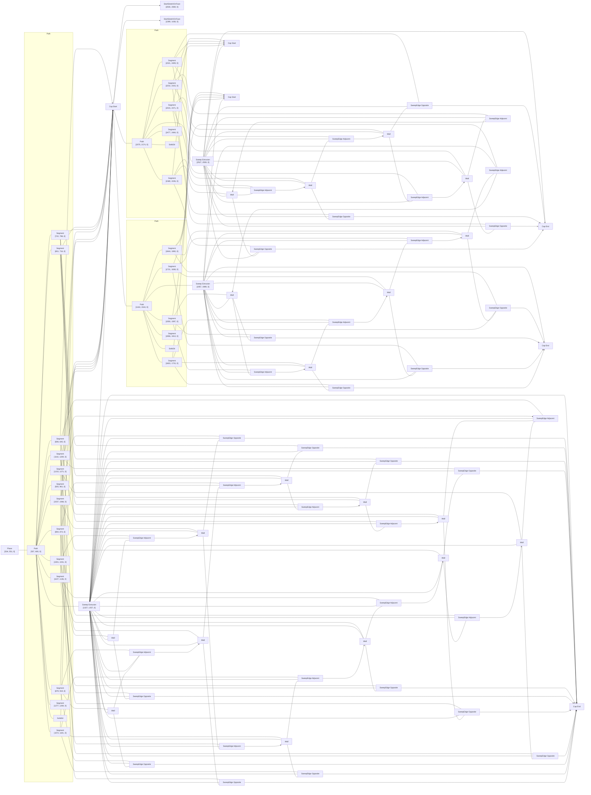

```mermaid
flowchart LR
  subgraph path4 [Path]
    4["Path<br>[557, 600, 0]"]
    7["Segment<br>[606, 645, 0]"]
    8["Segment<br>[651, 716, 0]"]
    9["Segment<br>[722, 798, 0]"]
    10["Segment<br>[804, 873, 0]"]
    11["Segment<br>[879, 919, 0]"]
    12["Segment<br>[925, 961, 0]"]
    13["Segment<br>[1001, 1031, 0]"]
    14["Segment<br>[1037, 1066, 0]"]
    15["Segment<br>[1072, 1101, 0]"]
    16["Segment<br>[1107, 1136, 0]"]
    17["Segment<br>[1142, 1209, 0]"]
    18["Segment<br>[1215, 1271, 0]"]
    19["Segment<br>[1277, 1284, 0]"]
    30[Solid2d]
  end
  subgraph path5 [Path]
    5["Path<br>[1444, 1544, 0]"]
    20["Segment<br>[1550, 1597, 0]"]
    21["Segment<br>[1603, 1715, 0]"]
    22["Segment<br>[1721, 1838, 0]"]
    23["Segment<br>[1844, 1900, 0]"]
    24["Segment<br>[1906, 1913, 0]"]
    31[Solid2d]
  end
  subgraph path6 [Path]
    6["Path<br>[2075, 2174, 0]"]
    25["Segment<br>[2180, 2226, 0]"]
    26["Segment<br>[2232, 2315, 0]"]
    27["Segment<br>[2321, 2409, 0]"]
    28["Segment<br>[2415, 2471, 0]"]
    29["Segment<br>[2477, 2484, 0]"]
    32[Solid2d]
  end
  1["Plane<br>[534, 551, 0]"]
  2["StartSketchOnFace<br>[2030, 2069, 0]"]
  3["StartSketchOnFace<br>[1399, 1438, 0]"]
  33["Sweep Extrusion<br>[1327, 1357, 0]"]
  34["Sweep Extrusion<br>[1957, 1989, 0]"]
  35["Sweep Extrusion<br>[2527, 2559, 0]"]
  36[Wall]
  37[Wall]
  38[Wall]
  39[Wall]
  40[Wall]
  41[Wall]
  42[Wall]
  43[Wall]
  44[Wall]
  45[Wall]
  46[Wall]
  47[Wall]
  48[Wall]
  49[Wall]
  50[Wall]
  51[Wall]
  52[Wall]
  53[Wall]
  54[Wall]
  55["Cap Start"]
  56["Cap Start"]
  57["Cap Start"]
  58["Cap End"]
  59["Cap End"]
  60["Cap End"]
  61["SweepEdge Opposite"]
  62["SweepEdge Opposite"]
  63["SweepEdge Opposite"]
  64["SweepEdge Opposite"]
  65["SweepEdge Opposite"]
  66["SweepEdge Opposite"]
  67["SweepEdge Opposite"]
  68["SweepEdge Opposite"]
  69["SweepEdge Opposite"]
  70["SweepEdge Opposite"]
  71["SweepEdge Opposite"]
  72["SweepEdge Opposite"]
  73["SweepEdge Opposite"]
  74["SweepEdge Opposite"]
  75["SweepEdge Opposite"]
  76["SweepEdge Opposite"]
  77["SweepEdge Opposite"]
  78["SweepEdge Opposite"]
  79["SweepEdge Opposite"]
  80["SweepEdge Adjacent"]
  81["SweepEdge Adjacent"]
  82["SweepEdge Adjacent"]
  83["SweepEdge Adjacent"]
  84["SweepEdge Adjacent"]
  85["SweepEdge Adjacent"]
  86["SweepEdge Adjacent"]
  87["SweepEdge Adjacent"]
  88["SweepEdge Adjacent"]
  89["SweepEdge Adjacent"]
  90["SweepEdge Adjacent"]
  91["SweepEdge Adjacent"]
  92["SweepEdge Adjacent"]
  93["SweepEdge Adjacent"]
  94["SweepEdge Adjacent"]
  95["SweepEdge Adjacent"]
  96["SweepEdge Adjacent"]
  97["SweepEdge Adjacent"]
  1 --- 4
  57 x--> 2
  57 x--> 3
  4 --- 7
  4 --- 8
  4 --- 9
  4 --- 10
  4 --- 11
  4 --- 12
  4 --- 13
  4 --- 14
  4 --- 15
  4 --- 16
  4 --- 17
  4 --- 18
  4 --- 19
  4 --- 30
  4 ---- 33
  5 --- 20
  5 --- 21
  5 --- 22
  5 --- 23
  5 --- 24
  5 --- 31
  5 ---- 34
  57 --- 5
  6 --- 25
  6 --- 26
  6 --- 27
  6 --- 28
  6 --- 29
  6 --- 32
  6 ---- 35
  57 --- 6
  7 --- 43
  7 x--> 57
  7 --- 67
  7 --- 85
  8 --- 40
  8 x--> 57
  8 --- 63
  8 --- 82
  9 --- 39
  9 x--> 57
  9 --- 62
  9 --- 86
  10 --- 41
  10 x--> 57
  10 --- 71
  10 --- 89
  11 --- 38
  11 x--> 57
  11 --- 69
  11 --- 84
  13 --- 42
  13 x--> 57
  13 --- 66
  13 --- 87
  14 --- 45
  14 x--> 57
  14 --- 61
  14 --- 80
  15 --- 44
  15 x--> 57
  15 --- 70
  15 --- 81
  16 --- 36
  16 x--> 57
  16 --- 65
  16 --- 83
  17 --- 37
  17 x--> 57
  17 --- 64
  17 --- 88
  18 --- 46
  18 x--> 57
  18 --- 68
  18 x--> 85
  20 --- 54
  20 x--> 56
  20 --- 77
  20 --- 95
  21 --- 52
  21 x--> 56
  21 --- 79
  21 --- 97
  22 --- 51
  22 x--> 56
  22 --- 78
  22 --- 96
  23 --- 53
  23 x--> 56
  23 --- 76
  23 --- 94
  25 --- 48
  25 x--> 55
  25 --- 75
  25 --- 93
  26 --- 47
  26 x--> 55
  26 --- 74
  26 --- 90
  27 --- 49
  27 x--> 55
  27 --- 72
  27 --- 92
  28 --- 50
  28 x--> 55
  28 --- 73
  28 --- 91
  33 --- 36
  33 --- 37
  33 --- 38
  33 --- 39
  33 --- 40
  33 --- 41
  33 --- 42
  33 --- 43
  33 --- 44
  33 --- 45
  33 --- 46
  33 --- 57
  33 --- 60
  33 --- 61
  33 --- 62
  33 --- 63
  33 --- 64
  33 --- 65
  33 --- 66
  33 --- 67
  33 --- 68
  33 --- 69
  33 --- 70
  33 --- 71
  33 --- 80
  33 --- 81
  33 --- 82
  33 --- 83
  33 --- 84
  33 --- 85
  33 --- 86
  33 --- 87
  33 --- 88
  33 --- 89
  34 --- 51
  34 --- 52
  34 --- 53
  34 --- 54
  34 --- 56
  34 --- 59
  34 --- 76
  34 --- 77
  34 --- 78
  34 --- 79
  34 --- 94
  34 --- 95
  34 --- 96
  34 --- 97
  35 --- 47
  35 --- 48
  35 --- 49
  35 --- 50
  35 --- 55
  35 --- 58
  35 --- 72
  35 --- 73
  35 --- 74
  35 --- 75
  35 --- 90
  35 --- 91
  35 --- 92
  35 --- 93
  36 --- 65
  81 <--x 36
  36 --- 83
  37 --- 64
  83 <--x 37
  37 --- 88
  38 --- 69
  38 --- 84
  39 --- 62
  39 --- 86
  89 <--x 39
  40 --- 63
  40 --- 82
  86 <--x 40
  41 --- 71
  84 <--x 41
  41 --- 89
  42 --- 66
  42 --- 87
  43 --- 67
  82 <--x 43
  43 --- 85
  44 --- 70
  80 <--x 44
  44 --- 81
  45 --- 61
  45 --- 80
  87 <--x 45
  46 --- 68
  46 --- 85
  88 <--x 46
  47 --- 74
  47 --- 90
  92 <--x 47
  48 --- 75
  90 <--x 48
  48 --- 93
  49 --- 72
  91 <--x 49
  49 --- 92
  50 --- 73
  50 --- 91
  93 <--x 50
  51 --- 78
  51 --- 96
  97 <--x 51
  52 --- 79
  95 <--x 52
  52 --- 97
  53 --- 76
  53 --- 94
  96 <--x 53
  54 --- 77
  94 <--x 54
  54 --- 95
  72 <--x 58
  73 <--x 58
  74 <--x 58
  75 <--x 58
  76 <--x 59
  77 <--x 59
  78 <--x 59
  79 <--x 59
  61 <--x 60
  62 <--x 60
  63 <--x 60
  64 <--x 60
  65 <--x 60
  66 <--x 60
  67 <--x 60
  68 <--x 60
  69 <--x 60
  70 <--x 60
  71 <--x 60
```
