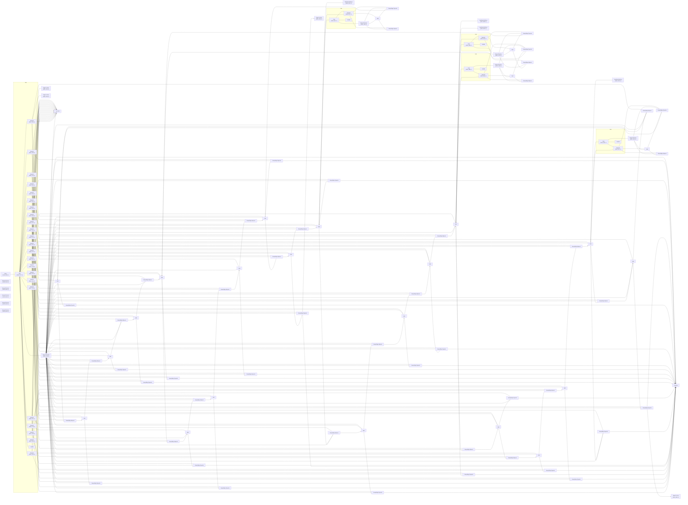

```mermaid
flowchart LR
  subgraph path6 [Path]
    6["Path<br>[1246, 1327, 0]"]
    11["Segment<br>[1333, 1361, 0]"]
    12["Segment<br>[1367, 1428, 0]"]
    13["Segment<br>[1434, 1515, 0]"]
    14["Segment<br>[1521, 1583, 0]"]
    15["Segment<br>[1589, 1625, 0]"]
    16["Segment<br>[1631, 1660, 0]"]
    17["Segment<br>[1666, 1728, 0]"]
    18["Segment<br>[1734, 1788, 0]"]
    19["Segment<br>[1794, 1855, 0]"]
    20["Segment<br>[1861, 1889, 0]"]
    21["Segment<br>[1895, 1934, 0]"]
    22["Segment<br>[1940, 1983, 0]"]
    23["Segment<br>[1989, 2051, 0]"]
    24["Segment<br>[2057, 2116, 0]"]
    25["Segment<br>[2122, 2183, 0]"]
    26["Segment<br>[2189, 2225, 0]"]
    27["Segment<br>[2231, 2261, 0]"]
    28["Segment<br>[2267, 2328, 0]"]
    29["Segment<br>[2334, 2393, 0]"]
    30["Segment<br>[2399, 2461, 0]"]
    31["Segment<br>[2467, 2510, 0]"]
    32["Segment<br>[2516, 2586, 0]"]
    33["Segment<br>[2592, 2599, 0]"]
    40[Solid2d]
  end
  subgraph path7 [Path]
    7["Path<br>[2938, 3027, 0]"]
    34["Segment<br>[2938, 3027, 0]"]
    41[Solid2d]
  end
  subgraph path8 [Path]
    8["Path<br>[3309, 3397, 0]"]
    35["Segment<br>[3309, 3397, 0]"]
    38[Solid2d]
  end
  subgraph path9 [Path]
    9["Path<br>[3686, 3866, 0]"]
    36["Segment<br>[3686, 3866, 0]"]
    39[Solid2d]
  end
  subgraph path10 [Path]
    10["Path<br>[4289, 4345, 0]"]
    37["Segment<br>[4289, 4345, 0]"]
    42[Solid2d]
  end
  1["Plane<br>[1223, 1240, 0]"]
  2["StartSketchOnFace<br>[3260, 3303, 0]"]
  3["StartSketchOnFace<br>[3637, 3680, 0]"]
  4["StartSketchOnFace<br>[4240, 4283, 0]"]
  5["StartSketchOnFace<br>[2889, 2932, 0]"]
  43["Sweep Extrusion<br>[2605, 2638, 0]"]
  44["Sweep Extrusion<br>[3156, 3184, 0]"]
  45["Sweep Extrusion<br>[3156, 3184, 0]"]
  46["Sweep Extrusion<br>[3526, 3554, 0]"]
  47["Sweep Extrusion<br>[3526, 3554, 0]"]
  48["Sweep Extrusion<br>[4120, 4148, 0]"]
  49["Sweep Extrusion<br>[4120, 4148, 0]"]
  50["Sweep Extrusion<br>[4120, 4148, 0]"]
  51["Sweep Extrusion<br>[4120, 4148, 0]"]
  52["Sweep Extrusion<br>[4351, 4379, 0]"]
  53[Wall]
  54[Wall]
  55[Wall]
  56[Wall]
  57[Wall]
  58[Wall]
  59[Wall]
  60[Wall]
  61[Wall]
  62[Wall]
  63[Wall]
  64[Wall]
  65[Wall]
  66[Wall]
  67[Wall]
  68[Wall]
  69[Wall]
  70[Wall]
  71[Wall]
  72[Wall]
  73[Wall]
  74[Wall]
  75[Wall]
  76[Wall]
  77["Cap Start"]
  78["Cap End"]
  79["SweepEdge Opposite"]
  80["SweepEdge Opposite"]
  81["SweepEdge Opposite"]
  82["SweepEdge Opposite"]
  83["SweepEdge Opposite"]
  84["SweepEdge Opposite"]
  85["SweepEdge Opposite"]
  86["SweepEdge Opposite"]
  87["SweepEdge Opposite"]
  88["SweepEdge Opposite"]
  89["SweepEdge Opposite"]
  90["SweepEdge Opposite"]
  91["SweepEdge Opposite"]
  92["SweepEdge Opposite"]
  93["SweepEdge Opposite"]
  94["SweepEdge Opposite"]
  95["SweepEdge Opposite"]
  96["SweepEdge Opposite"]
  97["SweepEdge Opposite"]
  98["SweepEdge Opposite"]
  99["SweepEdge Opposite"]
  100["SweepEdge Opposite"]
  101["SweepEdge Opposite"]
  102["SweepEdge Opposite"]
  103["SweepEdge Adjacent"]
  104["SweepEdge Adjacent"]
  105["SweepEdge Adjacent"]
  106["SweepEdge Adjacent"]
  107["SweepEdge Adjacent"]
  108["SweepEdge Adjacent"]
  109["SweepEdge Adjacent"]
  110["SweepEdge Adjacent"]
  111["SweepEdge Adjacent"]
  112["SweepEdge Adjacent"]
  113["SweepEdge Adjacent"]
  114["SweepEdge Adjacent"]
  115["SweepEdge Adjacent"]
  116["SweepEdge Adjacent"]
  117["SweepEdge Adjacent"]
  118["SweepEdge Adjacent"]
  119["SweepEdge Adjacent"]
  120["SweepEdge Adjacent"]
  121["SweepEdge Adjacent"]
  122["SweepEdge Adjacent"]
  123["SweepEdge Adjacent"]
  124["SweepEdge Adjacent"]
  125["SweepEdge Adjacent"]
  126["SweepEdge Adjacent"]
  127["EdgeCut Fillet<br>[2644, 2815, 0]"]
  128["EdgeCut Fillet<br>[2644, 2815, 0]"]
  129["EdgeCut Fillet<br>[2644, 2815, 0]"]
  130["EdgeCut Fillet<br>[2644, 2815, 0]"]
  1 --- 6
  71 x--> 2
  72 x--> 3
  72 x--> 4
  70 x--> 5
  6 --- 11
  6 --- 12
  6 --- 13
  6 --- 14
  6 --- 15
  6 --- 16
  6 --- 17
  6 --- 18
  6 --- 19
  6 --- 20
  6 --- 21
  6 --- 22
  6 --- 23
  6 --- 24
  6 --- 25
  6 --- 26
  6 --- 27
  6 --- 28
  6 --- 29
  6 --- 30
  6 --- 31
  6 --- 32
  6 --- 33
  6 --- 40
  6 ---- 43
  7 --- 34
  7 --- 41
  7 ---- 45
  70 --- 7
  8 --- 35
  8 --- 38
  8 ---- 47
  71 --- 8
  9 --- 36
  9 --- 39
  9 ---- 51
  72 --- 9
  10 --- 37
  10 --- 42
  10 ---- 52
  72 --- 10
  11 --- 66
  11 x--> 77
  11 --- 82
  11 --- 119
  12 --- 61
  12 x--> 77
  12 --- 96
  12 --- 109
  13 --- 60
  13 x--> 77
  13 --- 85
  13 --- 103
  14 --- 63
  14 x--> 77
  14 --- 88
  14 --- 122
  15 --- 57
  15 x--> 77
  15 --- 87
  15 --- 108
  17 --- 65
  17 x--> 77
  17 --- 91
  17 --- 114
  18 --- 69
  18 x--> 77
  18 --- 97
  18 --- 104
  19 --- 68
  19 x--> 77
  19 --- 86
  19 --- 116
  20 --- 55
  20 x--> 77
  20 --- 79
  20 --- 117
  21 --- 56
  21 x--> 77
  21 --- 92
  21 --- 106
  21 --- 127
  22 --- 70
  22 x--> 77
  22 --- 80
  22 --- 105
  23 --- 64
  23 x--> 77
  23 --- 98
  23 --- 111
  24 --- 58
  24 x--> 77
  24 --- 84
  24 --- 121
  25 --- 54
  25 x--> 77
  25 --- 83
  25 --- 107
  26 --- 72
  26 x--> 77
  26 --- 94
  26 --- 112
  28 --- 67
  28 x--> 77
  28 --- 89
  28 --- 110
  29 --- 53
  29 x--> 77
  29 --- 93
  29 --- 118
  30 --- 62
  30 x--> 77
  30 --- 95
  30 --- 115
  31 --- 71
  31 x--> 77
  31 --- 90
  31 --- 120
  32 --- 59
  32 x--> 77
  32 --- 81
  32 --- 113
  32 --- 130
  34 x--> 70
  34 --- 75
  34 --- 101
  34 --- 125
  35 x--> 71
  35 --- 73
  35 --- 99
  35 --- 123
  36 x--> 72
  36 --- 76
  36 --- 102
  36 --- 126
  37 x--> 72
  37 --- 74
  37 --- 100
  37 --- 124
  43 --- 53
  43 --- 54
  43 --- 55
  43 --- 56
  43 --- 57
  43 --- 58
  43 --- 59
  43 --- 60
  43 --- 61
  43 --- 62
  43 --- 63
  43 --- 64
  43 --- 65
  43 --- 66
  43 --- 67
  43 --- 68
  43 --- 69
  43 --- 70
  43 --- 71
  43 --- 72
  43 --- 77
  43 --- 78
  43 --- 79
  43 --- 80
  43 --- 81
  43 --- 82
  43 --- 83
  43 --- 84
  43 --- 85
  43 --- 86
  43 --- 87
  43 --- 88
  43 --- 89
  43 --- 90
  43 --- 91
  43 --- 92
  43 --- 93
  43 --- 94
  43 --- 95
  43 --- 96
  43 --- 97
  43 --- 98
  43 --- 103
  43 --- 104
  43 --- 105
  43 --- 106
  43 --- 107
  43 --- 108
  43 --- 109
  43 --- 110
  43 --- 111
  43 --- 112
  43 --- 113
  43 --- 114
  43 --- 115
  43 --- 116
  43 --- 117
  43 --- 118
  43 --- 119
  43 --- 120
  43 --- 121
  43 --- 122
  45 --- 75
  45 --- 101
  45 --- 125
  47 --- 73
  47 --- 99
  47 --- 123
  51 --- 76
  51 --- 102
  51 --- 126
  52 --- 74
  52 --- 100
  52 --- 124
  53 --- 93
  110 <--x 53
  53 --- 118
  54 --- 83
  54 --- 107
  121 <--x 54
  55 --- 79
  101 <--x 55
  116 <--x 55
  55 --- 117
  56 --- 92
  56 --- 106
  117 <--x 56
  57 --- 87
  100 <--x 57
  102 <--x 57
  57 --- 108
  122 <--x 57
  58 --- 84
  111 <--x 58
  58 --- 121
  59 --- 81
  59 --- 113
  120 <--x 59
  60 --- 85
  60 --- 103
  109 <--x 60
  61 --- 96
  61 --- 109
  119 <--x 61
  62 --- 95
  62 --- 115
  118 <--x 62
  63 --- 88
  103 <--x 63
  63 --- 122
  64 --- 98
  105 <--x 64
  64 --- 111
  65 --- 91
  108 <--x 65
  65 --- 114
  66 --- 82
  99 <--x 66
  113 <--x 66
  66 --- 119
  67 --- 89
  67 --- 110
  112 <--x 67
  68 --- 86
  104 <--x 68
  68 --- 116
  69 --- 97
  69 --- 104
  114 <--x 69
  70 --- 80
  70 --- 105
  106 <--x 70
  71 --- 90
  115 <--x 71
  71 --- 120
  72 --- 94
  107 <--x 72
  72 --- 112
  73 --- 99
  73 --- 123
  74 --- 100
  74 --- 124
  75 --- 101
  75 --- 125
  76 --- 102
  76 --- 126
  79 <--x 78
  80 <--x 78
  81 <--x 78
  82 <--x 78
  83 <--x 78
  84 <--x 78
  85 <--x 78
  86 <--x 78
  87 <--x 78
  88 <--x 78
  89 <--x 78
  90 <--x 78
  91 <--x 78
  92 <--x 78
  93 <--x 78
  94 <--x 78
  95 <--x 78
  96 <--x 78
  97 <--x 78
  98 <--x 78
  81 <--x 128
  92 <--x 129
```
