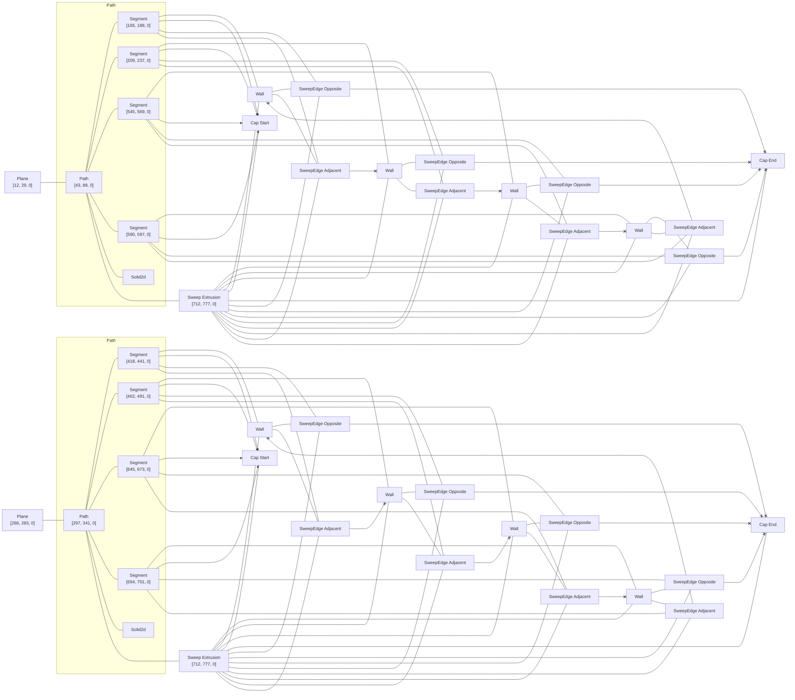

```mermaid
flowchart LR
  subgraph path3 [Path]
    3["Path<br>[43, 88, 0]"]
    5["Segment<br>[165, 188, 0]"]
    6["Segment<br>[209, 237, 0]"]
    9["Segment<br>[545, 569, 0]"]
    10["Segment<br>[590, 597, 0]"]
    14[Solid2d]
  end
  subgraph path4 [Path]
    4["Path<br>[297, 341, 0]"]
    7["Segment<br>[418, 441, 0]"]
    8["Segment<br>[462, 491, 0]"]
    11["Segment<br>[645, 673, 0]"]
    12["Segment<br>[694, 701, 0]"]
    13[Solid2d]
  end
  1["Plane<br>[12, 29, 0]"]
  2["Plane<br>[266, 283, 0]"]
  15["Sweep Extrusion<br>[712, 777, 0]"]
  16["Sweep Extrusion<br>[712, 777, 0]"]
  17[Wall]
  18[Wall]
  19[Wall]
  20[Wall]
  21[Wall]
  22[Wall]
  23[Wall]
  24[Wall]
  25["Cap Start"]
  26["Cap Start"]
  27["Cap End"]
  28["Cap End"]
  29["SweepEdge Opposite"]
  30["SweepEdge Opposite"]
  31["SweepEdge Opposite"]
  32["SweepEdge Opposite"]
  33["SweepEdge Opposite"]
  34["SweepEdge Opposite"]
  35["SweepEdge Opposite"]
  36["SweepEdge Opposite"]
  37["SweepEdge Adjacent"]
  38["SweepEdge Adjacent"]
  39["SweepEdge Adjacent"]
  40["SweepEdge Adjacent"]
  41["SweepEdge Adjacent"]
  42["SweepEdge Adjacent"]
  43["SweepEdge Adjacent"]
  44["SweepEdge Adjacent"]
  1 --- 3
  2 --- 4
  3 --- 5
  3 --- 6
  3 --- 9
  3 --- 10
  3 --- 14
  3 ---- 16
  4 --- 7
  4 --- 8
  4 --- 11
  4 --- 12
  4 --- 13
  4 ---- 15
  5 --- 24
  5 x--> 26
  5 --- 33
  5 --- 43
  6 --- 23
  6 x--> 26
  6 --- 36
  6 --- 41
  7 --- 19
  7 x--> 25
  7 --- 29
  7 --- 40
  8 --- 18
  8 x--> 25
  8 --- 32
  8 --- 39
  9 --- 21
  9 x--> 26
  9 --- 34
  9 --- 44
  10 --- 22
  10 x--> 26
  10 --- 35
  10 --- 42
  11 --- 20
  11 x--> 25
  11 --- 31
  11 --- 38
  12 --- 17
  12 x--> 25
  12 --- 30
  12 --- 37
  15 --- 17
  15 --- 18
  15 --- 19
  15 --- 20
  15 --- 25
  15 --- 27
  15 --- 29
  15 --- 30
  15 --- 31
  15 --- 32
  15 --- 37
  15 --- 38
  15 --- 39
  15 --- 40
  16 --- 21
  16 --- 22
  16 --- 23
  16 --- 24
  16 --- 26
  16 --- 28
  16 --- 33
  16 --- 34
  16 --- 35
  16 --- 36
  16 --- 41
  16 --- 42
  16 --- 43
  16 --- 44
  17 --- 30
  17 --- 37
  38 <--x 17
  18 --- 32
  18 --- 39
  40 <--x 18
  19 --- 29
  37 <--x 19
  19 --- 40
  20 --- 31
  20 --- 38
  39 <--x 20
  21 --- 34
  41 <--x 21
  21 --- 44
  22 --- 35
  22 --- 42
  44 <--x 22
  23 --- 36
  23 --- 41
  43 <--x 23
  24 --- 33
  42 <--x 24
  24 --- 43
  29 <--x 27
  30 <--x 27
  31 <--x 27
  32 <--x 27
  33 <--x 28
  34 <--x 28
  35 <--x 28
  36 <--x 28
```
