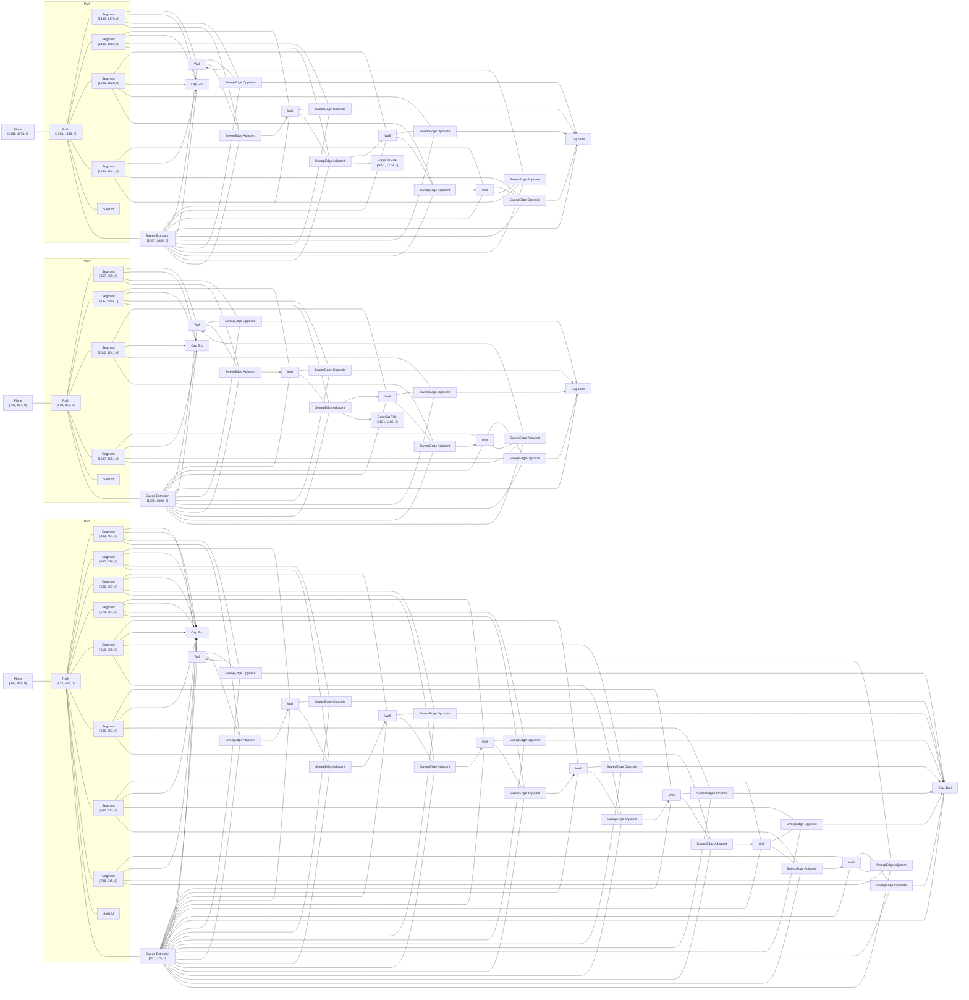

```mermaid
flowchart LR
  subgraph path4 [Path]
    4["Path<br>[412, 437, 0]"]
    7["Segment<br>[443, 484, 0]"]
    8["Segment<br>[490, 536, 0]"]
    9["Segment<br>[542, 567, 0]"]
    10["Segment<br>[573, 604, 0]"]
    11["Segment<br>[610, 639, 0]"]
    12["Segment<br>[645, 691, 0]"]
    13["Segment<br>[697, 732, 0]"]
    14["Segment<br>[738, 745, 0]"]
    24[Solid2d]
  end
  subgraph path5 [Path]
    5["Path<br>[810, 851, 0]"]
    15["Segment<br>[857, 900, 0]"]
    16["Segment<br>[906, 1006, 0]"]
    17["Segment<br>[1012, 1041, 0]"]
    18["Segment<br>[1047, 1054, 0]"]
    23[Solid2d]
  end
  subgraph path6 [Path]
    6["Path<br>[1384, 1433, 0]"]
    19["Segment<br>[1439, 1479, 0]"]
    20["Segment<br>[1485, 1585, 0]"]
    21["Segment<br>[1591, 1628, 0]"]
    22["Segment<br>[1634, 1641, 0]"]
    25[Solid2d]
  end
  1["Plane<br>[389, 406, 0]"]
  2["Plane<br>[787, 804, 0]"]
  3["Plane<br>[1361, 1378, 0]"]
  26["Sweep Extrusion<br>[751, 775, 0]"]
  27["Sweep Extrusion<br>[1060, 1098, 0]"]
  28["Sweep Extrusion<br>[1647, 1685, 0]"]
  29[Wall]
  30[Wall]
  31[Wall]
  32[Wall]
  33[Wall]
  34[Wall]
  35[Wall]
  36[Wall]
  37[Wall]
  38[Wall]
  39[Wall]
  40[Wall]
  41[Wall]
  42[Wall]
  43[Wall]
  44[Wall]
  45["Cap Start"]
  46["Cap Start"]
  47["Cap Start"]
  48["Cap End"]
  49["Cap End"]
  50["Cap End"]
  51["SweepEdge Opposite"]
  52["SweepEdge Opposite"]
  53["SweepEdge Opposite"]
  54["SweepEdge Opposite"]
  55["SweepEdge Opposite"]
  56["SweepEdge Opposite"]
  57["SweepEdge Opposite"]
  58["SweepEdge Opposite"]
  59["SweepEdge Opposite"]
  60["SweepEdge Opposite"]
  61["SweepEdge Opposite"]
  62["SweepEdge Opposite"]
  63["SweepEdge Opposite"]
  64["SweepEdge Opposite"]
  65["SweepEdge Opposite"]
  66["SweepEdge Opposite"]
  67["SweepEdge Adjacent"]
  68["SweepEdge Adjacent"]
  69["SweepEdge Adjacent"]
  70["SweepEdge Adjacent"]
  71["SweepEdge Adjacent"]
  72["SweepEdge Adjacent"]
  73["SweepEdge Adjacent"]
  74["SweepEdge Adjacent"]
  75["SweepEdge Adjacent"]
  76["SweepEdge Adjacent"]
  77["SweepEdge Adjacent"]
  78["SweepEdge Adjacent"]
  79["SweepEdge Adjacent"]
  80["SweepEdge Adjacent"]
  81["SweepEdge Adjacent"]
  82["SweepEdge Adjacent"]
  83["EdgeCut Fillet<br>[1104, 1185, 0]"]
  84["EdgeCut Fillet<br>[1691, 1773, 0]"]
  1 --- 4
  2 --- 5
  3 --- 6
  4 --- 7
  4 --- 8
  4 --- 9
  4 --- 10
  4 --- 11
  4 --- 12
  4 --- 13
  4 --- 14
  4 --- 24
  4 ---- 26
  5 --- 15
  5 --- 16
  5 --- 17
  5 --- 18
  5 --- 23
  5 ---- 27
  6 --- 19
  6 --- 20
  6 --- 21
  6 --- 22
  6 --- 25
  6 ---- 28
  7 --- 43
  7 x--> 49
  7 --- 59
  7 --- 75
  8 --- 40
  8 x--> 49
  8 --- 60
  8 --- 76
  9 --- 39
  9 x--> 49
  9 --- 61
  9 --- 77
  10 --- 41
  10 x--> 49
  10 --- 62
  10 --- 78
  11 --- 38
  11 x--> 49
  11 --- 63
  11 --- 79
  12 --- 37
  12 x--> 49
  12 --- 64
  12 --- 80
  13 --- 42
  13 x--> 49
  13 --- 65
  13 --- 81
  14 --- 44
  14 x--> 49
  14 --- 66
  14 --- 82
  15 --- 32
  15 x--> 50
  15 --- 51
  15 --- 67
  16 --- 29
  16 x--> 50
  16 --- 52
  16 --- 68
  17 --- 31
  17 x--> 50
  17 --- 53
  17 --- 69
  18 --- 30
  18 x--> 50
  18 --- 54
  18 --- 70
  19 --- 35
  19 x--> 48
  19 --- 58
  19 --- 74
  20 --- 33
  20 x--> 48
  20 --- 57
  20 --- 73
  21 --- 34
  21 x--> 48
  21 --- 56
  21 --- 72
  22 --- 36
  22 x--> 48
  22 --- 55
  22 --- 71
  26 --- 37
  26 --- 38
  26 --- 39
  26 --- 40
  26 --- 41
  26 --- 42
  26 --- 43
  26 --- 44
  26 --- 46
  26 --- 49
  26 --- 59
  26 --- 60
  26 --- 61
  26 --- 62
  26 --- 63
  26 --- 64
  26 --- 65
  26 --- 66
  26 --- 75
  26 --- 76
  26 --- 77
  26 --- 78
  26 --- 79
  26 --- 80
  26 --- 81
  26 --- 82
  27 --- 29
  27 --- 30
  27 --- 31
  27 --- 32
  27 --- 47
  27 --- 50
  27 --- 51
  27 --- 52
  27 --- 53
  27 --- 54
  27 --- 67
  27 --- 68
  27 --- 69
  27 --- 70
  28 --- 33
  28 --- 34
  28 --- 35
  28 --- 36
  28 --- 45
  28 --- 48
  28 --- 55
  28 --- 56
  28 --- 57
  28 --- 58
  28 --- 71
  28 --- 72
  28 --- 73
  28 --- 74
  29 --- 52
  67 <--x 29
  29 --- 68
  30 --- 54
  69 <--x 30
  30 --- 70
  31 --- 53
  68 <--x 31
  31 --- 69
  32 --- 51
  32 --- 67
  70 <--x 32
  33 --- 57
  33 --- 73
  74 <--x 33
  34 --- 56
  34 --- 72
  73 <--x 34
  35 --- 58
  71 <--x 35
  35 --- 74
  36 --- 55
  36 --- 71
  72 <--x 36
  37 --- 64
  79 <--x 37
  37 --- 80
  38 --- 63
  78 <--x 38
  38 --- 79
  39 --- 61
  76 <--x 39
  39 --- 77
  40 --- 60
  75 <--x 40
  40 --- 76
  41 --- 62
  77 <--x 41
  41 --- 78
  42 --- 65
  80 <--x 42
  42 --- 81
  43 --- 59
  43 --- 75
  82 <--x 43
  44 --- 66
  81 <--x 44
  44 --- 82
  55 <--x 45
  56 <--x 45
  57 <--x 45
  58 <--x 45
  59 <--x 46
  60 <--x 46
  61 <--x 46
  62 <--x 46
  63 <--x 46
  64 <--x 46
  65 <--x 46
  66 <--x 46
  51 <--x 47
  52 <--x 47
  53 <--x 47
  54 <--x 47
  68 <--x 83
  73 <--x 84
```
