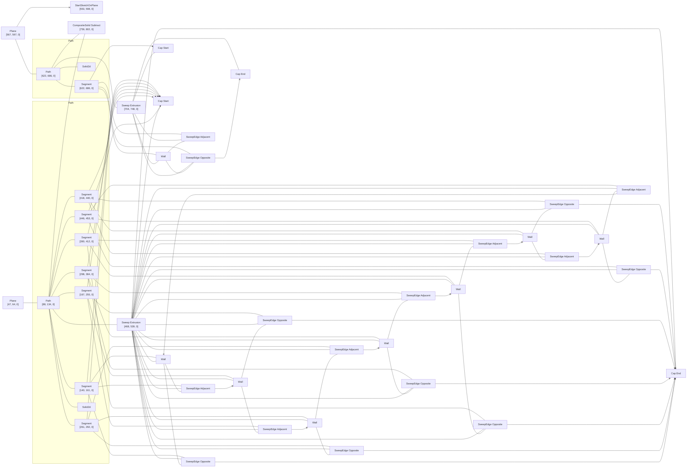

```mermaid
flowchart LR
  subgraph path4 [Path]
    4["Path<br>[88, 134, 0]"]
    6["Segment<br>[140, 161, 0]"]
    7["Segment<br>[167, 255, 0]"]
    8["Segment<br>[261, 292, 0]"]
    9["Segment<br>[298, 384, 0]"]
    10["Segment<br>[390, 412, 0]"]
    11["Segment<br>[418, 440, 0]"]
    12["Segment<br>[446, 453, 0]"]
    15[Solid2d]
  end
  subgraph path5 [Path]
    5["Path<br>[622, 686, 0]"]
    13["Segment<br>[622, 686, 0]"]
    14[Solid2d]
  end
  1["Plane<br>[47, 64, 0]"]
  2["Plane<br>[567, 597, 0]"]
  3["StartSketchOnPlane<br>[553, 598, 0]"]
  16["Sweep Extrusion<br>[468, 539, 0]"]
  17["Sweep Extrusion<br>[704, 748, 0]"]
  18["CompositeSolid Subtract<br>[759, 802, 0]"]
  19[Wall]
  20[Wall]
  21[Wall]
  22[Wall]
  23[Wall]
  24[Wall]
  25[Wall]
  26[Wall]
  27["Cap Start"]
  28["Cap Start"]
  29["Cap End"]
  30["Cap End"]
  31["SweepEdge Opposite"]
  32["SweepEdge Opposite"]
  33["SweepEdge Opposite"]
  34["SweepEdge Opposite"]
  35["SweepEdge Opposite"]
  36["SweepEdge Opposite"]
  37["SweepEdge Opposite"]
  38["SweepEdge Opposite"]
  39["SweepEdge Adjacent"]
  40["SweepEdge Adjacent"]
  41["SweepEdge Adjacent"]
  42["SweepEdge Adjacent"]
  43["SweepEdge Adjacent"]
  44["SweepEdge Adjacent"]
  45["SweepEdge Adjacent"]
  46["SweepEdge Adjacent"]
  1 --- 4
  2 <--x 3
  2 --- 5
  4 --- 6
  4 --- 7
  4 --- 8
  4 --- 9
  4 --- 10
  4 --- 11
  4 --- 12
  4 --- 15
  4 ---- 16
  4 --- 18
  5 --- 13
  5 --- 14
  5 ---- 17
  5 --- 18
  6 --- 26
  6 x--> 28
  6 --- 38
  6 --- 42
  7 --- 23
  7 x--> 28
  7 --- 34
  7 --- 46
  8 --- 22
  8 x--> 28
  8 --- 37
  8 --- 44
  9 --- 24
  9 x--> 28
  9 --- 35
  9 --- 41
  10 --- 21
  10 x--> 28
  10 --- 36
  10 --- 45
  11 --- 20
  11 x--> 28
  11 --- 32
  11 --- 43
  12 --- 25
  12 x--> 28
  12 --- 33
  12 --- 40
  13 --- 19
  13 x--> 27
  13 --- 31
  13 --- 39
  16 --- 20
  16 --- 21
  16 --- 22
  16 --- 23
  16 --- 24
  16 --- 25
  16 --- 26
  16 --- 28
  16 --- 30
  16 --- 32
  16 --- 33
  16 --- 34
  16 --- 35
  16 --- 36
  16 --- 37
  16 --- 38
  16 --- 40
  16 --- 41
  16 --- 42
  16 --- 43
  16 --- 44
  16 --- 45
  16 --- 46
  17 --- 19
  17 --- 27
  17 --- 29
  17 --- 31
  17 --- 39
  19 --- 31
  19 --- 39
  20 --- 32
  20 --- 43
  45 <--x 20
  21 --- 36
  41 <--x 21
  21 --- 45
  22 --- 37
  22 --- 44
  46 <--x 22
  23 --- 34
  42 <--x 23
  23 --- 46
  24 --- 35
  24 --- 41
  44 <--x 24
  25 --- 33
  25 --- 40
  43 <--x 25
  26 --- 38
  40 <--x 26
  26 --- 42
  31 <--x 29
  32 <--x 30
  33 <--x 30
  34 <--x 30
  35 <--x 30
  36 <--x 30
  37 <--x 30
  38 <--x 30
```
