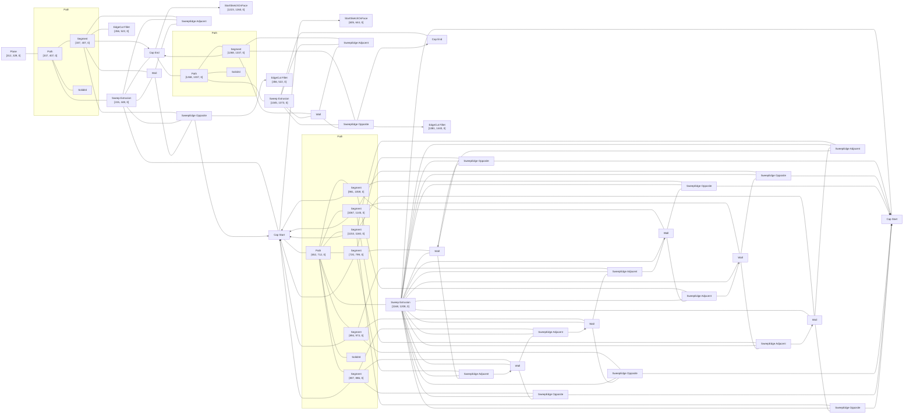

```mermaid
flowchart LR
  subgraph path4 [Path]
    4["Path<br>[337, 407, 0]"]
    7["Segment<br>[337, 407, 0]"]
    16[Solid2d]
  end
  subgraph path5 [Path]
    5["Path<br>[652, 712, 0]"]
    8["Segment<br>[720, 799, 0]"]
    9["Segment<br>[807, 886, 0]"]
    10["Segment<br>[894, 973, 0]"]
    11["Segment<br>[981, 1059, 0]"]
    12["Segment<br>[1067, 1145, 0]"]
    13["Segment<br>[1153, 1160, 0]"]
    15[Solid2d]
  end
  subgraph path6 [Path]
    6["Path<br>[1268, 1337, 0]"]
    14["Segment<br>[1268, 1337, 0]"]
    17[Solid2d]
  end
  1["Plane<br>[312, 329, 0]"]
  2["StartSketchOnFace<br>[1223, 1260, 0]"]
  3["StartSketchOnFace<br>[605, 644, 0]"]
  18["Sweep Extrusion<br>[415, 448, 0]"]
  19["Sweep Extrusion<br>[1168, 1208, 0]"]
  20["Sweep Extrusion<br>[1345, 1373, 0]"]
  21[Wall]
  22[Wall]
  23[Wall]
  24[Wall]
  25[Wall]
  26[Wall]
  27[Wall]
  28[Wall]
  29["Cap Start"]
  30["Cap Start"]
  31["Cap End"]
  32["Cap End"]
  33["SweepEdge Opposite"]
  34["SweepEdge Opposite"]
  35["SweepEdge Opposite"]
  36["SweepEdge Opposite"]
  37["SweepEdge Opposite"]
  38["SweepEdge Opposite"]
  39["SweepEdge Opposite"]
  40["SweepEdge Opposite"]
  41["SweepEdge Adjacent"]
  42["SweepEdge Adjacent"]
  43["SweepEdge Adjacent"]
  44["SweepEdge Adjacent"]
  45["SweepEdge Adjacent"]
  46["SweepEdge Adjacent"]
  47["SweepEdge Adjacent"]
  48["SweepEdge Adjacent"]
  49["EdgeCut Fillet<br>[456, 522, 0]"]
  50["EdgeCut Fillet<br>[456, 522, 0]"]
  51["EdgeCut Fillet<br>[1381, 1440, 0]"]
  1 --- 4
  31 x--> 2
  30 x--> 3
  4 --- 7
  4 --- 16
  4 ---- 18
  5 --- 8
  5 --- 9
  5 --- 10
  5 --- 11
  5 --- 12
  5 --- 13
  5 --- 15
  5 ---- 19
  30 --- 5
  6 --- 14
  6 --- 17
  6 ---- 20
  31 --- 6
  7 --- 21
  7 x--> 31
  7 --- 33
  7 --- 41
  7 --- 49
  8 --- 23
  8 x--> 30
  8 --- 34
  8 --- 45
  9 --- 27
  9 x--> 30
  9 --- 38
  9 --- 44
  10 --- 22
  10 x--> 30
  10 --- 37
  10 --- 46
  11 --- 25
  11 x--> 30
  11 --- 36
  11 --- 43
  12 --- 26
  12 x--> 30
  12 --- 35
  12 --- 47
  13 --- 24
  13 x--> 30
  13 --- 39
  13 --- 42
  14 --- 28
  14 x--> 31
  14 --- 40
  14 --- 48
  18 --- 21
  18 --- 30
  18 --- 31
  18 --- 33
  18 --- 41
  19 --- 22
  19 --- 23
  19 --- 24
  19 --- 25
  19 --- 26
  19 --- 27
  19 --- 29
  19 --- 34
  19 --- 35
  19 --- 36
  19 --- 37
  19 --- 38
  19 --- 39
  19 --- 42
  19 --- 43
  19 --- 44
  19 --- 45
  19 --- 46
  19 --- 47
  20 --- 28
  20 --- 32
  20 --- 40
  20 --- 48
  21 --- 33
  21 --- 41
  22 --- 37
  44 <--x 22
  22 --- 46
  23 --- 34
  42 <--x 23
  23 --- 45
  24 --- 39
  24 --- 42
  47 <--x 24
  25 --- 36
  25 --- 43
  46 <--x 25
  26 --- 35
  43 <--x 26
  26 --- 47
  27 --- 38
  27 --- 44
  45 <--x 27
  28 --- 40
  28 --- 48
  34 <--x 29
  35 <--x 29
  36 <--x 29
  37 <--x 29
  38 <--x 29
  39 <--x 29
  33 <--x 30
  40 <--x 32
  33 <--x 50
  40 <--x 51
```
