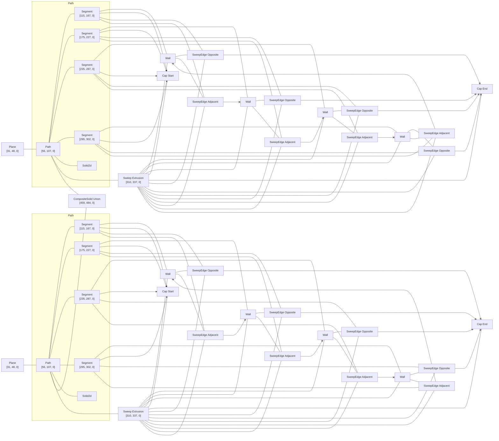

```mermaid
flowchart LR
  subgraph path3 [Path]
    3["Path<br>[56, 107, 0]"]
    5["Segment<br>[115, 167, 0]"]
    8["Segment<br>[175, 227, 0]"]
    9["Segment<br>[235, 287, 0]"]
    11["Segment<br>[295, 302, 0]"]
    13[Solid2d]
  end
  subgraph path4 [Path]
    4["Path<br>[56, 107, 0]"]
    6["Segment<br>[115, 167, 0]"]
    7["Segment<br>[175, 227, 0]"]
    10["Segment<br>[235, 287, 0]"]
    12["Segment<br>[295, 302, 0]"]
    14[Solid2d]
  end
  1["Plane<br>[31, 48, 0]"]
  2["Plane<br>[31, 48, 0]"]
  15["Sweep Extrusion<br>[310, 337, 0]"]
  16["Sweep Extrusion<br>[310, 337, 0]"]
  17["CompositeSolid Union<br>[459, 484, 0]"]
  18[Wall]
  19[Wall]
  20[Wall]
  21[Wall]
  22[Wall]
  23[Wall]
  24[Wall]
  25[Wall]
  26["Cap Start"]
  27["Cap Start"]
  28["Cap End"]
  29["Cap End"]
  30["SweepEdge Opposite"]
  31["SweepEdge Opposite"]
  32["SweepEdge Opposite"]
  33["SweepEdge Opposite"]
  34["SweepEdge Opposite"]
  35["SweepEdge Opposite"]
  36["SweepEdge Opposite"]
  37["SweepEdge Opposite"]
  38["SweepEdge Adjacent"]
  39["SweepEdge Adjacent"]
  40["SweepEdge Adjacent"]
  41["SweepEdge Adjacent"]
  42["SweepEdge Adjacent"]
  43["SweepEdge Adjacent"]
  44["SweepEdge Adjacent"]
  45["SweepEdge Adjacent"]
  1 --- 3
  2 --- 4
  3 --- 5
  3 --- 8
  3 --- 9
  3 --- 11
  3 --- 13
  3 ---- 16
  3 --- 17
  4 --- 6
  4 --- 7
  4 --- 10
  4 --- 12
  4 --- 14
  4 ---- 15
  4 --- 17
  5 --- 24
  5 x--> 26
  5 --- 34
  5 --- 43
  6 --- 21
  6 x--> 27
  6 --- 30
  6 --- 41
  7 --- 19
  7 x--> 27
  7 --- 31
  7 --- 40
  8 --- 25
  8 x--> 26
  8 --- 37
  8 --- 44
  9 --- 22
  9 x--> 26
  9 --- 36
  9 --- 42
  10 --- 18
  10 x--> 27
  10 --- 33
  10 --- 39
  11 --- 23
  11 x--> 26
  11 --- 35
  11 --- 45
  12 --- 20
  12 x--> 27
  12 --- 32
  12 --- 38
  15 --- 18
  15 --- 19
  15 --- 20
  15 --- 21
  15 --- 27
  15 --- 29
  15 --- 30
  15 --- 31
  15 --- 32
  15 --- 33
  15 --- 38
  15 --- 39
  15 --- 40
  15 --- 41
  16 --- 22
  16 --- 23
  16 --- 24
  16 --- 25
  16 --- 26
  16 --- 28
  16 --- 34
  16 --- 35
  16 --- 36
  16 --- 37
  16 --- 42
  16 --- 43
  16 --- 44
  16 --- 45
  18 --- 33
  18 --- 39
  40 <--x 18
  19 --- 31
  19 --- 40
  41 <--x 19
  20 --- 32
  20 --- 38
  39 <--x 20
  21 --- 30
  38 <--x 21
  21 --- 41
  22 --- 36
  22 --- 42
  44 <--x 22
  23 --- 35
  42 <--x 23
  23 --- 45
  24 --- 34
  24 --- 43
  45 <--x 24
  25 --- 37
  43 <--x 25
  25 --- 44
  34 <--x 28
  35 <--x 28
  36 <--x 28
  37 <--x 28
  30 <--x 29
  31 <--x 29
  32 <--x 29
  33 <--x 29
```
